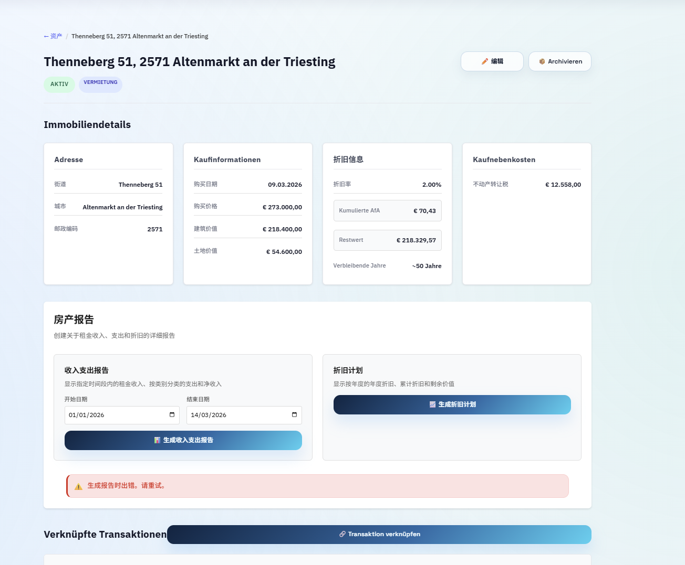

# 实施任务

## 任务 1: 数据库模型与迁移
- [x] 在 `backend/app/models/user.py` 的 User 模型中新增字段：account_status (String, default="active", indexed)、deactivated_at (DateTime)、scheduled_deletion_at (DateTime)、deletion_retry_count (Integer, default=0)、cancellation_reason (String)
- [x] 创建 `backend/app/models/account_deletion_log.py`，定义 AccountDeletionLog 模型（id, anonymous_user_hash, deleted_at, data_types_deleted JSON, deletion_method, initiated_by）
- [x] 在 `backend/app/models/__init__.py` 中注册 AccountDeletionLog
- [x] 创建 Alembic 迁移 `backend/alembic/versions/011_add_account_cancellation_fields.py`：User 表新增字段 + 创建 account_deletion_logs 表
- [x] 在 requirements.txt 中添加 `pyzipper` 依赖

### 需求映射
需求 3 (AC 1: account_status 字段), 需求 4 (AC 6: 删除确认记录), 需求 4 (AC 7: deletion_retry_count)

## 任务 2: Pydantic Schemas
- [x] 创建 `backend/app/schemas/account.py`，定义：DeactivateAccountRequest（password, reason, two_factor_code, confirmation_word）、CancellationImpactResponse（transaction_count, document_count, tax_report_count, property_count, has_active_subscription, subscription_days_remaining, cooling_off_days）、DataExportRequest（encryption_password）、DataExportStatusResponse（status, download_url, expires_at）、ReactivateAccountResponse、AdminCancellationStatsResponse

### 需求映射
需求 5 (AC 1-3: 密码验证和确认词), 需求 2 (AC 6: 加密密码), 需求 7 (AC 2-3: 前端数据结构)

## 任务 3: AccountCancellationService
- [x] 创建 `backend/app/services/account_cancellation_service.py`
- [x] 实现 `get_cancellation_impact(user_id)` — 查询用户数据数量和订阅状态，返回影响摘要
- [x] 实现 `deactivate_account(user_id, password, reason, confirmation_word, two_factor_code)` — 验证密码和确认词，设置 account_status="deactivated"，设置 deactivated_at=now，设置 scheduled_deletion_at=now+30天，调用 SubscriptionService.cancel_subscription 取消活跃订阅，创建审计日志
- [x] 实现 `reactivate_account(user_id)` — 检查 account_status=="deactivated" 且在冷静期内，恢复为 active，清除 deactivated_at 和 scheduled_deletion_at
- [x] 实现 `hard_delete_account(user_id, initiated_by)` — 按顺序：删除 MinIO 文档文件 → 匿名化 PaymentEvent 和 AuditLog（set user_id=NULL）→ 删除 User 记录（cascade 删除关联数据）→ 清除 Redis 缓存 → 创建 AccountDeletionLog
- [x] 实现 `get_admin_cancellation_stats()` — 返回注销统计数据

### 需求映射
需求 3 (AC 1-5: 软删除和重新激活), 需求 4 (AC 1-7: 硬删除流程), 需求 5 (AC 1-4: 安全验证), 需求 8 (AC 4: 统计数据)

## 任务 4: DataExportService
- [x] 创建 `backend/app/services/data_export_service.py`
- [x] 实现 `export_user_data(user_id, encryption_password)` — 查询用户全部数据，交易记录导出为 CSV，结构化数据导出为 JSON（含数据字典），文档文件保持原始格式，使用 pyzipper 进行 AES-256 加密打包，上传至 MinIO data-exports/ 桶，返回 48h 预签名下载链接
- [x] 创建 Celery 任务 `backend/app/tasks/data_export_tasks.py` 中的 `async_export_user_data(user_id, encryption_password)` — 异步执行导出，完成后存储下载链接

### 需求映射
需求 2 (AC 1-6: 数据导出完整流程)

## 任务 5: 认证端点修改
- [x] 修改 `backend/app/api/v1/endpoints/auth.py` 的 login 端点：查询用户后检查 account_status，若为 "deactivated" 返回 403 + 剩余冷静期天数和重新激活提示，若为 "deletion_pending" 返回 403 + 账号已计划删除提示

### 需求映射
需求 3 (AC 3: 拒绝停用账号登录)

## 任务 6: 账号管理 API 端点
- [x] 创建 `backend/app/api/v1/endpoints/account.py`
- [x] 实现 `POST /api/v1/account/cancellation-impact` — 调用 AccountCancellationService.get_cancellation_impact
- [x] 实现 `POST /api/v1/account/deactivate` — 调用 AccountCancellationService.deactivate_account
- [x] 实现 `POST /api/v1/account/reactivate` — 调用 AccountCancellationService.reactivate_account（无需登录，通过 token 链接验证）
- [x] 实现 `POST /api/v1/account/export-data` — 触发异步数据导出任务
- [x] 实现 `GET /api/v1/account/export-status/{task_id}` — 查询导出任务状态
- [x] 在 `backend/app/api/v1/router.py` 中注册 account 路由

### 需求映射
需求 5 (AC 1-5: 注销确认流程), 需求 2 (AC 1-5: 数据导出 API), 需求 3 (AC 5: 重新激活)

## 任务 7: 管理员端点扩展
- [x] 在 `backend/app/api/v1/endpoints/admin.py` 中新增：GET /admin/users 支持 status 查询参数筛选、POST /admin/users/{id}/hard-delete 手动触发硬删除、POST /admin/users/{id}/reactivate 手动重新激活、GET /admin/cancellation-stats 注销统计

### 需求映射
需求 8 (AC 1-5: 管理员账号管理)

## 任务 8: Celery 定时清理任务
- [x] 创建 `backend/app/tasks/account_cleanup_tasks.py`
- [x] 实现 `cleanup_expired_accounts` 任务 — 查找 account_status="deactivated" 且 scheduled_deletion_at < now 的账号执行硬删除；查找 deletion_pending 且 retry_count < 3 的重试；retry_count >= 3 发送管理员告警；生成清理报告日志
- [x] 实现 `send_deletion_reminders` 任务 — 查找 deactivated_at 距今 23 天的账号，发送提醒邮件
- [x] 在 Celery Beat 配置中注册定时任务（cleanup 每天凌晨 2 点，reminders 每天上午 9 点）

### 需求映射
需求 6 (AC 1-5: 定时清理任务), 需求 3 (AC 6: 第 23 天提醒)

## 任务 9: 前端 - 账号管理组件与退订
- [x] 创建 `frontend/src/services/accountService.ts` — 封装账号管理 API 调用
- [x] 创建 `frontend/src/stores/accountStore.ts` — Zustand store 管理注销/导出状态
- [x] 创建 `frontend/src/components/account/CancelSubscriptionModal.tsx` — 退订确认弹窗，显示当前订阅信息、到期日期，提供取消原因选择和确认按钮
- [x] 创建 `frontend/src/components/account/AccountManagementSection.tsx` — 设置页中的账号管理区域，包含"取消订阅"和"注销账号"两个独立入口
- [x] 在 ProfilePage.tsx 中集成 AccountManagementSection 组件

### 需求映射
需求 7 (AC 1-2, 7: 退订入口和确认), 需求 1 (AC 1-5: 订阅取消流程)

## 任务 10: 前端 - 注销向导与停用提示
- [x] 创建 `frontend/src/components/account/DeleteAccountWizard.tsx` — 三步骤注销向导：Step 1 注销影响摘要、Step 2 数据导出选项（可选）、Step 3 密码验证 + 输入确认词
- [x] 创建 `frontend/src/components/account/DeactivatedAccountBanner.tsx` — 登录页停用提示组件，显示账号已停用 + 剩余冷静期天数 + 重新激活按钮
- [x] 修改登录页面，当 API 返回 403 停用状态时显示 DeactivatedAccountBanner
- [x] 创建 `frontend/src/components/account/AccountManagement.css` — 账号管理相关样式

### 需求映射
需求 7 (AC 3-4, 6: 注销向导和停用提示), 需求 5 (AC 2-3: 影响摘要和确认)

## 任务 11: i18n 三语翻译
- [x] 在 `frontend/src/i18n/locales/de.json` 中新增 account 命名空间，包含所有注销/退订/数据导出/停用提示相关德语文案
- [x] 在 `frontend/src/i18n/locales/en.json` 中新增对应英语文案
- [x] 在 `frontend/src/i18n/locales/zh.json` 中新增对应中文文案

### 需求映射
需求 7 (AC 5: 三语支持)
