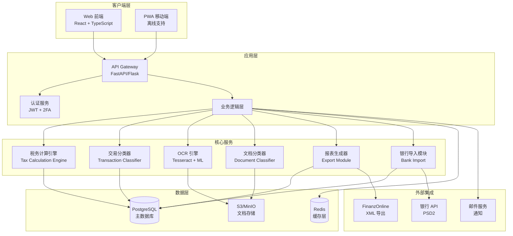
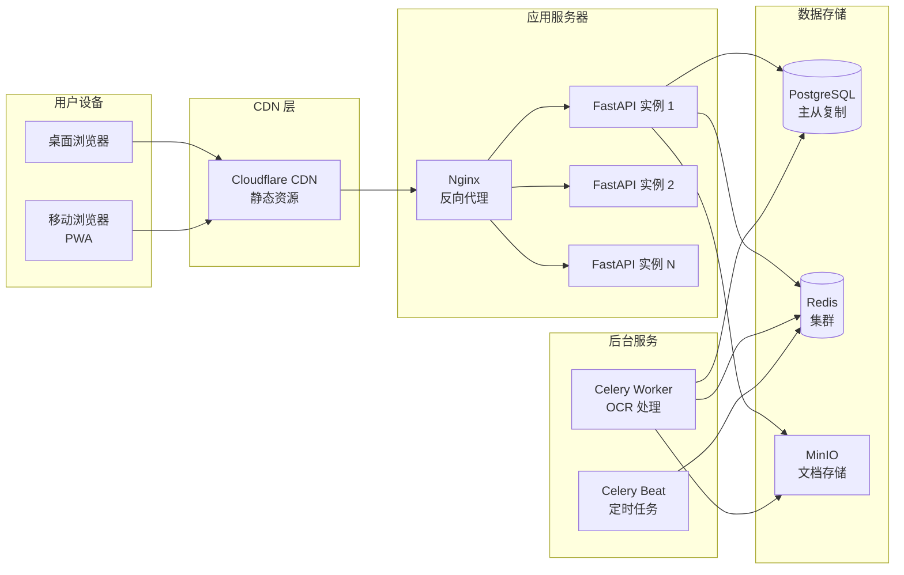
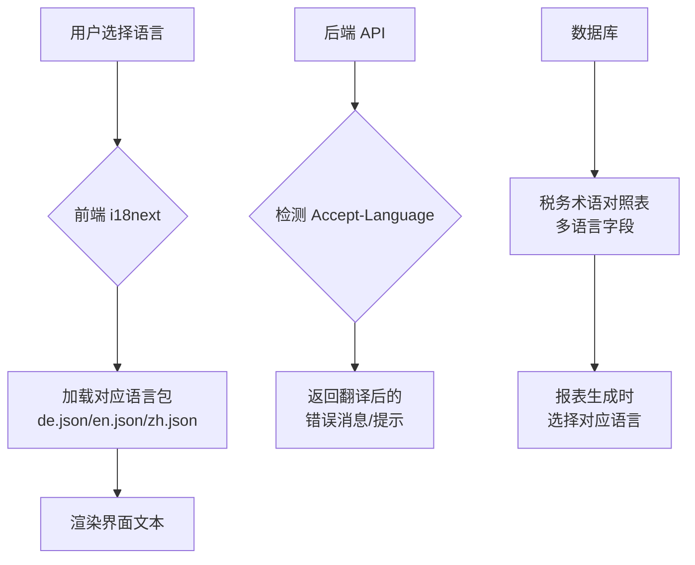
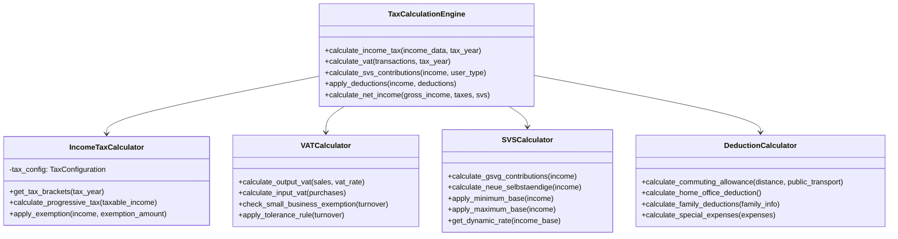
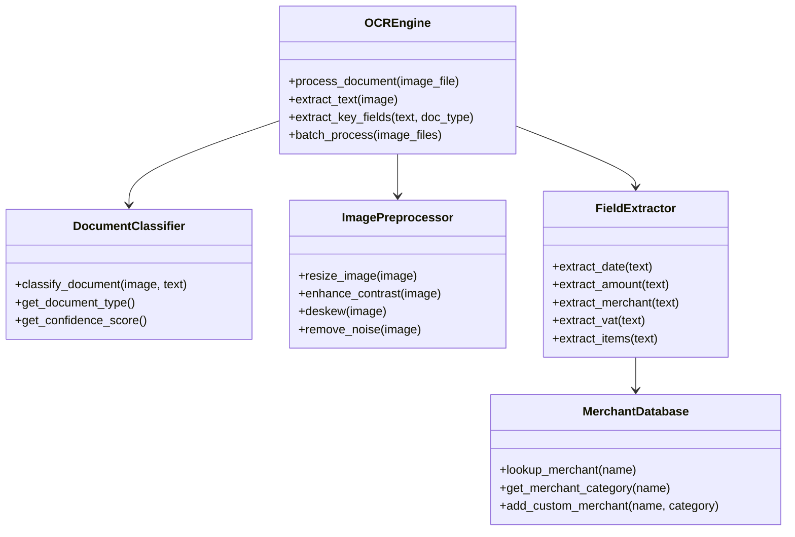
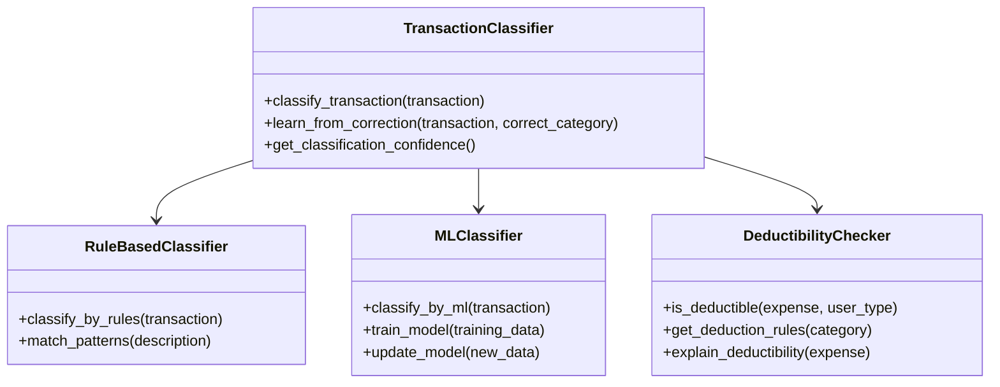
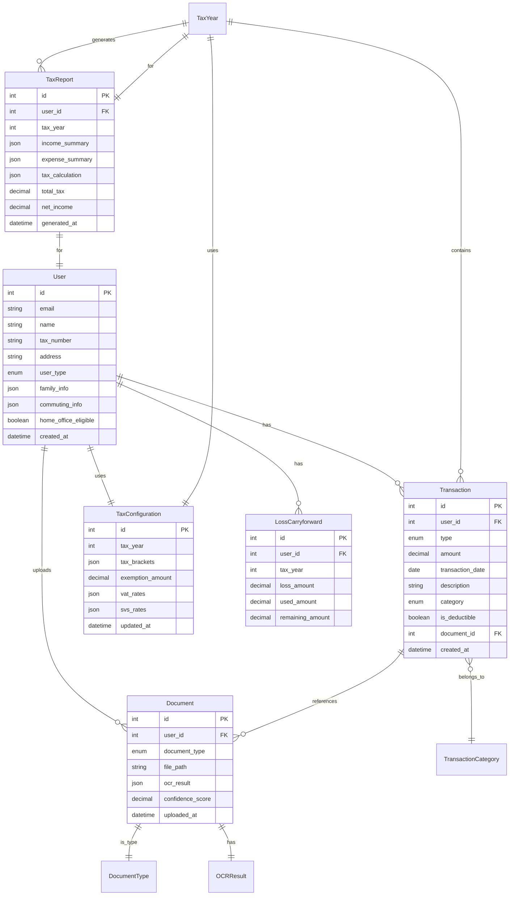

# Taxja 技术设计文档

## 概述

Taxja 是一个为奥地利纳税人设计的自动化税务管理平台，旨在简化复杂的税务处理流程。系统支持职员、房东、个体户和小型企业主管理收入支出、自动计算税款、生成报税文件，并与 FinanzOnline 系统集成。

### 品牌信息

- **产品名称**: Taxja
- **公司名称**: Taxja GmbH
- **品牌含义**: Tax（税）+ ja（德语"是/好"）→ "税务？是的，轻松搞定！"
- **Slogan**: "Taxja – Steuern einfach ja!"（税务，轻松说是！）
- **域名**: Taxja.at

### 核心价值主张

1. **智能自动化**: OCR 文档识别、自动交易分类、智能税款计算
2. **合规准确**: 基于 2026 年 USP 官方税率表，完整支持奥地利税法
3. **节税优化**: 平税制对比、亏损结转管理、家庭扣除计算
4. **审计就绪**: 完整文档存档、审计报告生成、合规性检查
5. **多语言支持**: 德语、英语、中文界面
6. **移动优先**: PWA 支持，随时随地拍照上传小票

### 设计目标

1. **准确性**: 税款计算误差 < €0.01（对比官方 USP 计算器）
2. **易用性**: 非专业用户也能轻松完成报税
3. **安全性**: AES-256 加密存储，TLS 1.3 传输加密，GDPR 合规
4. **性能**: OCR 批量处理 < 5 秒/文档，税款计算 < 1 秒
5. **可扩展性**: 支持税率表年度更新，模块化架构便于功能扩展


## 架构

### 整体架构

系统采用现代化的三层架构，结合微服务设计理念，确保可扩展性和可维护性。



### 技术栈选择

#### 前端技术栈

**选择**: React 18+ with TypeScript + Vite

**理由**:
- React 生态成熟，组件化开发效率高
- TypeScript 提供类型安全，减少运行时错误
- Vite 构建速度快，开发体验好
- 支持 PWA，满足移动端需求
- 丰富的 UI 组件库（Ant Design / Material-UI）

**关键库**:
- **状态管理**: Zustand（轻量级，比 Redux 简单）
- **路由**: React Router v6
- **表单**: React Hook Form + Zod（类型安全验证）
- **图表**: Recharts（税务趋势可视化）
- **国际化**: i18next（德语/英语/中文）
- **PWA**: Workbox（离线支持）

#### 后端技术栈

**选择**: Python 3.11+ with FastAPI

**理由**:
- FastAPI 性能优异（基于 Starlette 和 Pydantic）
- 自动生成 OpenAPI 文档，便于前后端协作
- 异步支持，适合 I/O 密集型操作（OCR、文件处理）
- Python 生态丰富，OCR 和 ML 库支持好
- 类型提示（Type Hints）提高代码质量

**关键库**:
- **Web 框架**: FastAPI
- **ORM**: SQLAlchemy 2.0（异步支持）
- **数据验证**: Pydantic v2
- **认证**: python-jose（JWT）+ pyotp（2FA）
- **任务队列**: Celery + Redis（OCR 批量处理）
- **OCR**: pytesseract + OpenCV
- **ML**: scikit-learn（交易分类）
- **PDF 生成**: ReportLab
- **XML 处理**: lxml

#### 数据库

**选择**: PostgreSQL 15+

**理由**:
- 成熟稳定，ACID 保证数据一致性
- 支持 JSONB 类型（存储 OCR 提取数据）
- 强大的查询优化器
- 支持全文搜索（文档检索）
- 良好的备份和恢复机制

**缓存层**: Redis 7+
- 会话存储
- 税款计算结果缓存
- Celery 任务队列

#### 文档存储

**选择**: MinIO（自托管）或 AWS S3

**理由**:
- 对象存储适合大量文档图片
- MinIO 兼容 S3 API，可自托管降低成本
- 支持加密存储（AES-256）
- 可设置生命周期策略（自动归档）

#### OCR 引擎

**选择**: Tesseract 5.0+ + 自定义训练模型

**理由**:
- 开源免费，支持德语和英语
- 可训练自定义模型（奥地利文档格式）
- 社区活跃，持续更新
- 可结合 OpenCV 预处理提高识别率

**备选方案**: Google Cloud Vision API（商业方案，识别率更高但成本高）


### 部署架构

**推荐方案**: 响应式 Web + PWA



**部署环境**:
- **开发环境**: Docker Compose（本地开发）
- **测试环境**: Kubernetes（自动化测试）
- **生产环境**: Kubernetes + Helm（高可用部署）

**容器化**:
- 前端: Nginx + 静态文件
- 后端: Python 3.11 + FastAPI
- OCR Worker: Python 3.11 + Tesseract
- 数据库: PostgreSQL 官方镜像
- 缓存: Redis 官方镜像
- 存储: MinIO 官方镜像

**CI/CD 流程**:
1. 代码提交 → GitHub Actions 触发
2. 运行单元测试 + 集成测试
3. 构建 Docker 镜像
4. 推送到容器仓库
5. 自动部署到测试环境
6. 手动审批后部署到生产环境

### 多语言支持架构

**实现方案**: i18next + 后端翻译表



**支持语言**:
- **德语（de）**: 主要语言，所有税务术语使用官方德语
- **英语（en）**: 国际用户，税务术语附德语原文
- **中文（zh）**: 华人用户，税务术语附德语原文

**翻译策略**:
- UI 文本: 前端 i18next 翻译文件
- 税务术语: 数据库存储多语言对照
- 错误消息: 后端根据 Accept-Language 返回
- 报表: 生成时根据用户语言设置选择模板


## 组件和接口

### 核心模块设计

#### 2.1 税务计算引擎（Tax Calculation Engine）

**职责**: 核心税款计算逻辑，支持所得税、增值税、社会保险计算

**组件结构**:



**所得税计算模块**:

```python
class IncomeTaxCalculator:
    def __init__(self, tax_config: TaxConfiguration):
        self.tax_config = tax_config
    
    def calculate_progressive_tax(self, taxable_income: Decimal, tax_year: int) -> TaxResult:
        """
        根据 2026 年 USP 税率表计算累进税
        
        税级（2026年）:
        - €0 – €13,539: 0%
        - €13,539 – €21,992: 20%
        - €21,992 – €36,458: 30%
        - €36,458 – €70,365: 40%
        - €70,365 – €104,859: 48%
        - €104,859 – €1,000,000: 50%
        - €1,000,000+: 55%
        """
        brackets = self.tax_config.get_tax_brackets(tax_year)
        total_tax = Decimal('0.00')
        breakdown = []
        
        remaining_income = taxable_income
        
        for bracket in brackets:
            if remaining_income <= 0:
                break
            
            taxable_in_bracket = min(
                remaining_income,
                bracket.upper_limit - bracket.lower_limit
            )
            
            tax_in_bracket = taxable_in_bracket * bracket.rate
            total_tax += tax_in_bracket
            
            breakdown.append({
                'bracket': f"€{bracket.lower_limit:,.2f} - €{bracket.upper_limit:,.2f}",
                'rate': f"{bracket.rate * 100}%",
                'taxable_amount': taxable_in_bracket,
                'tax_amount': tax_in_bracket
            })
            
            remaining_income -= taxable_in_bracket
        
        return TaxResult(
            total_tax=total_tax.quantize(Decimal('0.01')),
            breakdown=breakdown,
            effective_rate=total_tax / taxable_income if taxable_income > 0 else Decimal('0')
        )
```

**增值税计算模块**:

```python
class VATCalculator:
    STANDARD_RATE = Decimal('0.20')  # 20%
    RESIDENTIAL_RATE = Decimal('0.10')  # 10% 住宅租赁
    SMALL_BUSINESS_THRESHOLD = Decimal('55000.00')
    TOLERANCE_THRESHOLD = Decimal('60500.00')
    
    def calculate_vat_liability(
        self,
        gross_turnover: Decimal,
        transactions: List[Transaction],
        property_type: Optional[PropertyType] = None
    ) -> VATResult:
        """计算增值税义务"""
        
        # 检查小企业免税
        if gross_turnover <= self.SMALL_BUSINESS_THRESHOLD:
            return VATResult(
                exempt=True,
                reason="小企业免税（营业额 ≤ €55,000）"
            )
        
        # 检查容忍规则
        if gross_turnover <= self.TOLERANCE_THRESHOLD:
            return VATResult(
                exempt=True,
                reason="容忍规则适用（营业额 ≤ €60,500），次年自动取消免税",
                warning="建议咨询 Steuerberater 是否主动纳税以抵扣进项税"
            )
        
        # 计算销项税和进项税
        output_vat = self._calculate_output_vat(transactions, property_type)
        input_vat = self._calculate_input_vat(transactions)
        
        return VATResult(
            exempt=False,
            output_vat=output_vat,
            input_vat=input_vat,
            net_vat=output_vat - input_vat
        )
    
    def _calculate_output_vat(
        self,
        transactions: List[Transaction],
        property_type: Optional[PropertyType]
    ) -> Decimal:
        """计算销项税"""
        total_vat = Decimal('0.00')
        
        for txn in transactions:
            if txn.type == TransactionType.INCOME:
                if property_type == PropertyType.RESIDENTIAL:
                    # 住宅租赁可选择 10% 或豁免
                    rate = self.RESIDENTIAL_RATE if txn.vat_opted_in else Decimal('0')
                elif property_type == PropertyType.COMMERCIAL:
                    # 商业租赁必须 20%
                    rate = self.STANDARD_RATE
                else:
                    # 其他收入标准 20%
                    rate = self.STANDARD_RATE
                
                total_vat += txn.amount * rate / (Decimal('1') + rate)
        
        return total_vat.quantize(Decimal('0.01'))
```


**SVS 社会保险计算模块**:

```python
class SVSCalculator:
    # 2026 年费率（动态计算）
    PENSION_RATE = Decimal('0.185')  # 养老保险 18.5%
    HEALTH_RATE = Decimal('0.068')   # 医疗保险 6.8%
    ACCIDENT_FIXED = Decimal('12.95')  # 事故保险固定 €12.95/月
    SUPPLEMENTARY_PENSION_RATE = Decimal('0.0153')  # 补充养老 1.53%
    
    # 缴费基数限制
    GSVG_MIN_BASE_MONTHLY = Decimal('551.10')  # GSVG 最低基数/月
    GSVG_MIN_INCOME_YEARLY = Decimal('6613.20')  # GSVG 最低收入/年
    NEUE_MIN_MONTHLY = Decimal('160.81')  # 新自雇最低缴费/月
    MAX_BASE_MONTHLY = Decimal('8085.00')  # 最高基数/月
    
    def calculate_contributions(
        self,
        annual_income: Decimal,
        user_type: UserType
    ) -> SVSResult:
        """计算社会保险缴费"""
        
        if user_type == UserType.EMPLOYEE:
            # 职员由雇主代扣，不需要单独计算
            return SVSResult(total=Decimal('0'), note="职员社保由雇主代扣")
        
        monthly_income = annual_income / Decimal('12')
        
        if user_type == UserType.GSVG:
            return self._calculate_gsvg(monthly_income, annual_income)
        elif user_type == UserType.NEUE_SELBSTAENDIGE:
            return self._calculate_neue_selbstaendige(monthly_income)
        
        raise ValueError(f"不支持的用户类型: {user_type}")
    
    def _calculate_gsvg(
        self,
        monthly_income: Decimal,
        annual_income: Decimal
    ) -> SVSResult:
        """计算 GSVG 缴费"""
        
        # 检查最低收入要求
        if annual_income < self.GSVG_MIN_INCOME_YEARLY:
            return SVSResult(
                total=Decimal('0'),
                note=f"年收入低于 €{self.GSVG_MIN_INCOME_YEARLY}，无需缴纳 GSVG"
            )
        
        # 应用最低和最高基数
        contribution_base = max(
            self.GSVG_MIN_BASE_MONTHLY,
            min(monthly_income, self.MAX_BASE_MONTHLY)
        )
        
        # 动态计算费率（随基数变化）
        pension = contribution_base * self.PENSION_RATE
        health = contribution_base * self.HEALTH_RATE
        accident = self.ACCIDENT_FIXED
        supplementary = contribution_base * self.SUPPLEMENTARY_PENSION_RATE
        
        monthly_total = pension + health + accident + supplementary
        annual_total = monthly_total * Decimal('12')
        
        return SVSResult(
            monthly_total=monthly_total.quantize(Decimal('0.01')),
            annual_total=annual_total.quantize(Decimal('0.01')),
            breakdown={
                'pension': pension.quantize(Decimal('0.01')),
                'health': health.quantize(Decimal('0.01')),
                'accident': accident,
                'supplementary': supplementary.quantize(Decimal('0.01'))
            },
            contribution_base=contribution_base,
            deductible=True  # 可作为 Sonderausgaben 抵扣
        )
```

**家庭扣除计算模块**:

```python
class DeductionCalculator:
    # 通勤补贴（Pendlerpauschale）
    COMMUTE_BRACKETS = {
        'small': {  # 小通勤补贴（公共交通可用）
            20: Decimal('58.00'),   # 20-40km: €58/月
            40: Decimal('113.00'),  # 40-60km: €113/月
            60: Decimal('168.00'),  # 60km+: €168/月
        },
        'large': {  # 大通勤补贴（公共交通不可用）
        20: Decimal('31.00'),   # 20-40km: €31/月
            40: Decimal('123.00'),  # 40-60km: €123/月
            60: Decimal('214.00'),  # 60km+: €214/月
        }
    }
    PENDLER_EURO_PER_KM = Decimal('6.00')  # €6/km/年
    HOME_OFFICE_DEDUCTION = Decimal('300.00')  # €300/年
    
    def calculate_commuting_allowance(
        self,
        distance_km: int,
        public_transport_available: bool,
        working_days_per_year: int = 220
    ) -> DeductionResult:
        """计算通勤补贴"""
        
        if distance_km < 20:
            return DeductionResult(
                amount=Decimal('0'),
                note="通勤距离小于 20km，不符合 Pendlerpauschale 条件"
            )
        
        # 选择小通勤或大通勤补贴
        bracket_type = 'small' if public_transport_available else 'large'
        brackets = self.COMMUTE_BRACKETS[bracket_type]
        
        # 确定基础金额
        if distance_km >= 60:
            base_monthly = brackets[60]
        elif distance_km >= 40:
            base_monthly = brackets[40]
        else:
            base_monthly = brackets[20]
        
        base_annual = base_monthly * Decimal('12')
        
        # 计算 Pendlereuro
        pendler_euro = Decimal(distance_km) * self.PENDLER_EURO_PER_KM
        
        total = base_annual + pendler_euro
        
        return DeductionResult(
            amount=total.quantize(Decimal('0.01')),
            breakdown={
                'type': 'Kleines Pendlerpauschale' if public_transport_available else 'Großes Pendlerpauschale',
                'base_monthly': base_monthly,
                'base_annual': base_annual,
                'pendler_euro': pendler_euro,
                'distance_km': distance_km
            }
        )
    
    def calculate_family_deductions(
        self,
        family_info: FamilyInfo
    ) -> DeductionResult:
        """计算家庭扣除"""
        
        # Kinderabsetzbetrag（子女扣除）
        # 2026 年标准：€58.40/月/子女
        child_deduction_monthly = Decimal('58.40')
        child_deduction = child_deduction_monthly * Decimal('12') * Decimal(family_info.num_children)
        
        # 单亲扣除
        single_parent_deduction = Decimal('494.00') if family_info.is_single_parent else Decimal('0')
        
        total = child_deduction + single_parent_deduction
        
        return DeductionResult(
            amount=total.quantize(Decimal('0.01')),
            breakdown={
                'child_deduction': child_deduction,
                'single_parent_deduction': single_parent_deduction,
                'num_children': family_info.num_children
            }
        )
```


#### 2.2 OCR 智能识别模块（OCR Engine + Document Classifier）

**职责**: 文档图片识别、文本提取、数据结构化

**组件结构**:



**OCR 引擎实现**:

```python
class OCREngine:
    def __init__(self):
        self.tesseract_config = '--oem 3 --psm 6 -l deu+eng'
        self.preprocessor = ImagePreprocessor()
        self.classifier = DocumentClassifier()
        self.extractor = FieldExtractor()
    
    def process_document(self, image_file: UploadFile) -> OCRResult:
        """处理单个文档"""
        
        # 1. 读取图片
        image = cv2.imdecode(
            np.frombuffer(image_file.file.read(), np.uint8),
            cv2.IMREAD_COLOR
        )
        
        # 2. 图片预处理
        processed_image = self.preprocessor.preprocess(image)
        
        # 3. OCR 文本提取
        text = pytesseract.image_to_string(
            processed_image,
            config=self.tesseract_config
        )
        
        # 4. 文档分类
        doc_type, confidence = self.classifier.classify(image, text)
        
        # 5. 字段提取
        extracted_data = self.extractor.extract_fields(text, doc_type)
        
        # 6. 置信度评分
        overall_confidence = self._calculate_confidence(
            extracted_data,
            confidence
        )
        
        return OCRResult(
            document_type=doc_type,
            extracted_data=extracted_data,
            raw_text=text,
            confidence_score=overall_confidence,
            needs_review=overall_confidence < 0.6
        )
    
    def batch_process(
        self,
        image_files: List[UploadFile]
    ) -> BatchOCRResult:
        """批量处理文档"""
        
        results = []
        grouped_results = defaultdict(list)
        
        for image_file in image_files:
            result = self.process_document(image_file)
            results.append(result)
            
            # 智能分组（按文档类型和月份）
            group_key = (
                result.document_type,
                result.extracted_data.get('date', '').strftime('%Y-%m')
            )
            grouped_results[group_key].append(result)
        
        # 生成汇总建议
        suggestions = self._generate_batch_suggestions(grouped_results)
        
        return BatchOCRResult(
            results=results,
            grouped_results=grouped_results,
            suggestions=suggestions
        )
```

**文档分类器实现**:

```python
class DocumentClassifier:
    def __init__(self):
        self.ml_model = self._load_model()
        self.patterns = self._load_patterns()
    
    def classify(self, image: np.ndarray, text: str) -> Tuple[DocumentType, float]:
        """分类文档类型"""
        
        # 方法 1: 基于关键词模式匹配
        pattern_result = self._classify_by_patterns(text)
        
        # 方法 2: 基于 ML 模型
        ml_result = self._classify_by_ml(image, text)
        
        # 综合两种方法的结果
        if pattern_result['confidence'] > 0.8:
            return pattern_result['type'], pattern_result['confidence']
        
        return ml_result['type'], ml_result['confidence']
    
    def _classify_by_patterns(self, text: str) -> Dict:
        """基于模式匹配分类"""
        
        text_lower = text.lower()
        
        # 工资单特征
        if any(keyword in text_lower for keyword in [
            'lohnzettel', 'gehaltsabrechnung', 'brutto', 'netto', 'lohnsteuer'
        ]):
            return {'type': DocumentType.PAYSLIP, 'confidence': 0.9}
        
        # 超市小票特征
        if any(merchant in text_lower for merchant in [
            'billa', 'spar', 'hofer', 'lidl', 'merkur'
        ]):
            return {'type': DocumentType.RECEIPT, 'confidence': 0.85}
        
        # SVS 缴费通知单
        if 'svs' in text_lower and 'beitrag' in text_lower:
            return {'type': DocumentType.SVS_NOTICE, 'confidence': 0.9}
        
        # 采购账单
        if 'rechnung' in text_lower and 'ust' in text_lower:
            return {'type': DocumentType.INVOICE, 'confidence': 0.75}
        
        # 租赁合同
        if 'mietvertrag' in text_lower or 'miete' in text_lower:
            return {'type': DocumentType.RENTAL_CONTRACT, 'confidence': 0.8}
        
        return {'type': DocumentType.UNKNOWN, 'confidence': 0.3}
    
    def _classify_by_ml(self, image: np.ndarray, text: str) -> Dict:
        """基于机器学习模型分类"""
        
        # 提取特征
        features = self._extract_features(image, text)
        
        # 预测
        prediction = self.ml_model.predict_proba([features])[0]
        doc_type_idx = np.argmax(prediction)
        confidence = prediction[doc_type_idx]
        
        doc_type = DocumentType(doc_type_idx)
        
        return {'type': doc_type, 'confidence': float(confidence)}
```

**字段提取器实现**:

```python
class FieldExtractor:
    def __init__(self):
        self.merchant_db = MerchantDatabase()
    
    def extract_fields(
        self,
        text: str,
        doc_type: DocumentType
    ) -> Dict[str, Any]:
        """根据文档类型提取字段"""
        
        if doc_type == DocumentType.PAYSLIP:
            return self._extract_payslip_fields(text)
        elif doc_type == DocumentType.RECEIPT:
            return self._extract_receipt_fields(text)
        elif doc_type == DocumentType.INVOICE:
            return self._extract_invoice_fields(text)
        elif doc_type == DocumentType.SVS_NOTICE:
            return self._extract_svs_fields(text)
        else:
            return self._extract_generic_fields(text)
    
    def _extract_receipt_fields(self, text: str) -> Dict[str, Any]:
        """提取超市小票字段"""
        
        # 提取日期（DD.MM.YYYY 格式）
        date_pattern = r'(\d{2})\.(\d{2})\.(\d{4})'
        date_match = re.search(date_pattern, text)
        date = None
        if date_match:
            day, month, year = date_match.groups()
            date = datetime(int(year), int(month), int(day))
        
        # 提取总金额（€ 格式）
        amount_pattern = r'(?:summe|gesamt|total).*?€?\s*(\d+[,\.]\d{2})'
        amount_match = re.search(amount_pattern, text, re.IGNORECASE)
        amount = None
        if amount_match:
            amount_str = amount_match.group(1).replace(',', '.')
            amount = Decimal(amount_str)
        
        # 提取商家名称
        merchant = self._extract_merchant_name(text)
        
        # 提取项目明细
        items = self._extract_line_items(text)
        
        # 提取增值税
        vat_amounts = self._extract_vat_amounts(text)
        
        return {
            'date': date,
            'amount': amount,
            'merchant': merchant,
            'items': items,
            'vat_amounts': vat_amounts,
            'confidence': {
                'date': 0.9 if date else 0.0,
                'amount': 0.9 if amount else 0.0,
                'merchant': 0.8 if merchant else 0.0
            }
        }
    
    def _extract_merchant_name(self, text: str) -> Optional[str]:
        """提取商家名称"""
        
        # 先查询已知商家数据库
        known_merchants = ['billa', 'spar', 'hofer', 'lidl', 'merkur']
        text_lower = text.lower()
        
        for merchant in known_merchants:
            if merchant in text_lower:
                return self.merchant_db.get_official_name(merchant)
        
        # 如果不是已知商家，尝试从文本前几行提取
        lines = text.split('\n')[:5]
        for line in lines:
            line = line.strip()
            if len(line) > 3 and not line.isdigit():
                return line
        
        return None
    
    def _extract_vat_amounts(self, text: str) -> Dict[str, Decimal]:
        """提取增值税金额"""
        
        vat_amounts = {}
        
        # 20% USt
        pattern_20 = r'20%?\s*ust.*?€?\s*(\d+[,\.]\d{2})'
        match_20 = re.search(pattern_20, text, re.IGNORECASE)
        if match_20:
            vat_amounts['20%'] = Decimal(match_20.group(1).replace(',', '.'))
        
        # 10% USt
        pattern_10 = r'10%?\s*ust.*?€?\s*(\d+[,\.]\d{2})'
        match_10 = re.search(pattern_10, text, re.IGNORECASE)
        if match_10:
            vat_amounts['10%'] = Decimal(match_10.group(1).replace(',', '.'))
        
        return vat_amounts
```


**奥地利商家数据库**:

```python
class MerchantDatabase:
    """奥地利常见商家数据库"""
    
    KNOWN_MERCHANTS = {
        'billa': {
            'official_name': 'BILLA AG',
            'category': ExpenseCategory.GROCERIES,
            'vat_rate': Decimal('0.20')
        },
        'spar': {
            'official_name': 'SPAR Österreich',
            'category': ExpenseCategory.GROCERIES,
            'vat_rate': Decimal('0.20')
        },
        'hofer': {
            'official_name': 'HOFER KG',
            'category': ExpenseCategory.GROCERIES,
            'vat_rate': Decimal('0.20')
        },
        'lidl': {
            'official_name': 'Lidl Österreich',
            'category': ExpenseCategory.GROCERIES,
            'vat_rate': Decimal('0.20')
        },
        'merkur': {
            'official_name': 'MERKUR',
            'category': ExpenseCategory.GROCERIES,
            'vat_rate': Decimal('0.20')
        },
        'obi': {
            'official_name': 'OBI Bau- und Heimwerkermärkte',
            'category': ExpenseCategory.MAINTENANCE,
            'vat_rate': Decimal('0.20')
        },
        'baumax': {
            'official_name': 'bauMax',
            'category': ExpenseCategory.MAINTENANCE,
            'vat_rate': Decimal('0.20')
        }
    }
    
    def lookup_merchant(self, name: str) -> Optional[Dict]:
        """查询商家信息"""
        name_lower = name.lower()
        for key, info in self.KNOWN_MERCHANTS.items():
            if key in name_lower:
                return info
        return None
    
    def add_custom_merchant(
        self,
        user_id: int,
        name: str,
        category: ExpenseCategory
    ):
        """用户自定义商家学习"""
        # 存储到数据库，用于个性化识别
        pass
```

#### 2.3 交易管理模块（Transaction Classifier）

**职责**: 自动分类交易、机器学习优化

**组件结构**:



**交易分类器实现**:

```python
class TransactionClassifier:
    def __init__(self):
        self.rule_classifier = RuleBasedClassifier()
        self.ml_classifier = MLClassifier()
        self.deductibility_checker = DeductibilityChecker()
    
    def classify_transaction(
        self,
        transaction: Transaction,
        user_context: UserContext
    ) -> ClassificationResult:
        """分类交易"""
        
        # 1. 基于规则的分类
        rule_result = self.rule_classifier.classify(transaction)
        
        # 2. 基于 ML 的分类
        ml_result = self.ml_classifier.classify(transaction, user_context)
        
        # 3. 综合判断
        if rule_result.confidence > 0.8:
            category = rule_result.category
            confidence = rule_result.confidence
        else:
            category = ml_result.category
            confidence = ml_result.confidence
        
        # 4. 检查可抵扣性
        is_deductible, deduction_reason = self.deductibility_checker.check(
            transaction,
            category,
            user_context.user_type
        )
        
        return ClassificationResult(
            category=category,
            confidence=confidence,
            is_deductible=is_deductible,
            deduction_reason=deduction_reason,
            needs_review=confidence < 0.7
        )
    
    def learn_from_correction(
        self,
        transaction: Transaction,
        correct_category: TransactionCategory,
        user_id: int
    ):
        """从用户修正中学习"""
        
        # 记录修正
        correction = ClassificationCorrection(
            transaction_id=transaction.id,
            original_category=transaction.category,
            correct_category=correct_category,
            user_id=user_id,
            timestamp=datetime.now()
        )
        
        # 更新 ML 模型
        self.ml_classifier.add_training_example(
            transaction,
            correct_category,
            user_id
        )
        
        # 如果积累了足够的修正数据，重新训练模型
        if self.ml_classifier.should_retrain():
            self.ml_classifier.retrain()
```

**可抵扣性检查器**:

```python
class DeductibilityChecker:
    """检查费用是否可抵扣"""
    
    DEDUCTION_RULES = {
        UserType.EMPLOYEE: {
            ExpenseCategory.COMMUTING: {
                'deductible': True,
                'condition': 'distance >= 20km',
                'reason': 'Pendlerpauschale 适用'
            },
            ExpenseCategory.HOME_OFFICE: {
                'deductible': True,
                'max_amount': Decimal('300.00'),
                'reason': '家庭办公室平额扣除 €300/年'
            },
            ExpenseCategory.GROCERIES: {
                'deductible': False,
                'reason': '职员个人生活费用不可抵扣'
            }
        },
        UserType.SELF_EMPLOYED: {
            ExpenseCategory.OFFICE_SUPPLIES: {
                'deductible': True,
                'reason': '业务办公用品可全额抵扣'
            },
            ExpenseCategory.EQUIPMENT: {
                'deductible': True,
                'condition': 'business_use_percentage > 0',
                'reason': '业务设备可按使用比例抵扣'
            },
            ExpenseCategory.GROCERIES: {
                'deductible': 'partial',
                'reason': '需判断是否用于业务（如客户招待）',
                'requires_review': True
            },
            ExpenseCategory.TRAVEL: {
                'deductible': True,
                'condition': 'business_purpose',
                'reason': '业务差旅费可抵扣'
            }
        },
        UserType.LANDLORD: {
            ExpenseCategory.MAINTENANCE: {
                'deductible': True,
                'reason': '房产维护费用可抵扣'
            },
            ExpenseCategory.PROPERTY_TAX: {
                'deductible': True,
                'reason': '房产税可抵扣'
            },
            ExpenseCategory.INSURANCE: {
                'deductible': True,
                'condition': 'property_related',
                'reason': '房产相关保险可抵扣'
            }
        }
    }
    
    def check(
        self,
        transaction: Transaction,
        category: ExpenseCategory,
        user_type: UserType
    ) -> Tuple[bool, str]:
        """检查是否可抵扣"""
        
        if transaction.type != TransactionType.EXPENSE:
            return False, "收入不需要检查可抵扣性"
        
        rules = self.DEDUCTION_RULES.get(user_type, {})
        rule = rules.get(category)
        
        if not rule:
            return False, f"{category.value} 不在 {user_type.value} 的可抵扣列表中"
        
        if rule['deductible'] == False:
            return False, rule['reason']
        
        if rule['deductible'] == 'partial':
            return True, f"⚠️ {rule['reason']}"
        
        # 检查条件
        if 'condition' in rule:
            # 这里需要根据具体条件进行检查
            # 简化示例，实际需要更复杂的逻辑
            pass
        
        return True, rule['reason']
    
    def suggest_deductible_items(
        self,
        receipt_items: List[ReceiptItem],
        user_type: UserType
    ) -> List[DeductionSuggestion]:
        """智能建议哪些项目可抵扣（超市小票场景）"""
        
        suggestions = []
        
        for item in receipt_items:
            # 基于商品名称判断
            if user_type == UserType.SELF_EMPLOYED:
                if self._is_office_supply(item.name):
                    suggestions.append(DeductionSuggestion(
                        item=item,
                        deductible=True,
                        reason="办公用品，可全额抵扣",
                        confidence=0.8
                    ))
                elif self._is_food_item(item.name):
                    suggestions.append(DeductionSuggestion(
                        item=item,
                        deductible='maybe',
                        reason="食品类，如用于客户招待可抵扣，需用户确认",
                        confidence=0.5,
                        requires_confirmation=True
                    ))
                else:
                    suggestions.append(DeductionSuggestion(
                        item=item,
                        deductible=False,
                        reason="个人生活用品，不可抵扣",
                        confidence=0.7
                    ))
        
        return suggestions
```


#### 2.4 银行导入模块（Bank Import Module）

**职责**: 导入银行交易数据、PSD2 API 集成、重复检测

**组件结构**:

```python
class BankImportModule:
    def __init__(self):
        self.csv_parser = CSVParser()
        self.mt940_parser = MT940Parser()
        self.psd2_client = PSD2Client()
        self.duplicate_detector = DuplicateDetector()
    
    def import_from_csv(
        self,
        csv_file: UploadFile,
        bank_format: BankFormat
    ) -> ImportResult:
        """从 CSV 导入"""
        
        # 解析 CSV
        transactions = self.csv_parser.parse(csv_file, bank_format)
        
        # 检测重复
        new_transactions = self.duplicate_detector.filter_duplicates(
            transactions
        )
        
        # 自动分类
        classified_transactions = []
        for txn in new_transactions:
            classification = self.classifier.classify_transaction(txn)
            txn.category = classification.category
            txn.is_deductible = classification.is_deductible
            classified_transactions.append(txn)
        
        return ImportResult(
            total_count=len(transactions),
            new_count=len(new_transactions),
            duplicate_count=len(transactions) - len(new_transactions),
            transactions=classified_transactions
        )
    
    def import_from_psd2(
        self,
        bank: Bank,
        account_id: str,
        date_from: date,
        date_to: date
    ) -> ImportResult:
        """通过 PSD2 API 导入"""
        
        # 调用银行 API
        transactions = self.psd2_client.get_transactions(
            bank=bank,
            account_id=account_id,
            date_from=date_from,
            date_to=date_to
        )
        
        # 后续处理同 CSV 导入
        return self.import_from_csv(transactions, BankFormat.PSD2)

class DuplicateDetector:
    """重复交易检测"""
    
    def filter_duplicates(
        self,
        new_transactions: List[Transaction],
        existing_transactions: List[Transaction]
    ) -> List[Transaction]:
        """过滤重复交易"""
        
        unique_transactions = []
        
        for new_txn in new_transactions:
            is_duplicate = False
            
            for existing_txn in existing_transactions:
                if self._is_duplicate(new_txn, existing_txn):
                    is_duplicate = True
                    break
            
            if not is_duplicate:
                unique_transactions.append(new_txn)
        
        return unique_transactions
    
    def _is_duplicate(
        self,
        txn1: Transaction,
        txn2: Transaction
    ) -> bool:
        """判断两笔交易是否重复"""
        
        # 相同日期、金额、描述视为重复
        return (
            txn1.date == txn2.date and
            txn1.amount == txn2.amount and
            self._similar_description(txn1.description, txn2.description)
        )
    
    def _similar_description(self, desc1: str, desc2: str) -> bool:
        """描述相似度判断"""
        from difflib import SequenceMatcher
        ratio = SequenceMatcher(None, desc1, desc2).ratio()
        return ratio > 0.8
```

#### 2.5 报表生成模块（Export Module）

**职责**: 生成 PDF/CSV/XML 报表、FinanzOnline XML 导出

**组件结构**:

```python
class ExportModule:
    def __init__(self):
        self.pdf_generator = PDFGenerator()
        self.csv_generator = CSVGenerator()
        self.xml_generator = FinanzOnlineXMLGenerator()
    
    def generate_tax_report_pdf(
        self,
        tax_year: int,
        user: User,
        tax_data: TaxData,
        language: Language
    ) -> bytes:
        """生成 PDF 税务报表"""
        
        template = self._get_template(language)
        
        pdf = self.pdf_generator.create_pdf(
            template=template,
            data={
                'user': user,
                'tax_year': tax_year,
                'income_summary': tax_data.income_summary,
                'expense_summary': tax_data.expense_summary,
                'tax_calculation': tax_data.tax_calculation,
                'svs_contributions': tax_data.svs_contributions,
                'deductions': tax_data.deductions,
                'net_income': tax_data.net_income
            }
        )
        
        return pdf
    
    def generate_finanzonline_xml(
        self,
        tax_year: int,
        user: User,
        tax_data: TaxData
    ) -> str:
        """生成 FinanzOnline XML"""
        
        xml = self.xml_generator.generate(
            tax_year=tax_year,
            user=user,
            tax_data=tax_data
        )
        
        # 验证 XML 格式
        self.xml_generator.validate(xml)
        
        return xml

class FinanzOnlineXMLGenerator:
    """FinanzOnline XML 生成器"""
    
    def generate(
        self,
        tax_year: int,
        user: User,
        tax_data: TaxData
    ) -> str:
        """生成符合 FinanzOnline 格式的 XML"""
        
        root = ET.Element('Einkommensteuererklärung')
        root.set('Jahr', str(tax_year))
        root.set('Version', '2026.1')
        
        # 纳税人信息
        taxpayer = ET.SubElement(root, 'Steuerpflichtiger')
        ET.SubElement(taxpayer, 'Steuernummer').text = user.tax_number
        ET.SubElement(taxpayer, 'Name').text = user.name
        ET.SubElement(taxpayer, 'Adresse').text = user.address
        
        # 收入信息
        income = ET.SubElement(root, 'Einkünfte')
        
        if tax_data.employment_income > 0:
            employment = ET.SubElement(income, 'NichtselbständigeArbeit')
            ET.SubElement(employment, 'Betrag').text = str(tax_data.employment_income)
        
        if tax_data.rental_income > 0:
            rental = ET.SubElement(income, 'Vermietung')
            ET.SubElement(rental, 'Einnahmen').text = str(tax_data.rental_income)
            ET.SubElement(rental, 'Werbungskosten').text = str(tax_data.rental_expenses)
        
        if tax_data.self_employment_income > 0:
            self_emp = ET.SubElement(income, 'SelbständigeArbeit')
            ET.SubElement(self_emp, 'Einnahmen').text = str(tax_data.self_employment_income)
            ET.SubElement(self_emp, 'Betriebsausgaben').text = str(tax_data.business_expenses)
        
        # 扣除项
        deductions = ET.SubElement(root, 'Sonderausgaben')
        
        if tax_data.svs_contributions > 0:
            ET.SubElement(deductions, 'Sozialversicherung').text = str(tax_data.svs_contributions)
        
        if tax_data.commuting_allowance > 0:
            ET.SubElement(deductions, 'Pendlerpauschale').text = str(tax_data.commuting_allowance)
        
        # 税款计算
        tax_calc = ET.SubElement(root, 'Steuerberechnung')
        ET.SubElement(tax_calc, 'Einkommen').text = str(tax_data.total_income)
        ET.SubElement(tax_calc, 'ZuVersteuerndesEinkommen').text = str(tax_data.taxable_income)
        ET.SubElement(tax_calc, 'Einkommensteuer').text = str(tax_data.income_tax)
        
        # 格式化 XML
        xml_str = ET.tostring(root, encoding='unicode', method='xml')
        return self._prettify_xml(xml_str)
    
    def validate(self, xml: str) -> bool:
        """验证 XML 格式"""
        
        try:
            # 加载 FinanzOnline XSD schema
            schema = ET.XMLSchema(file='schemas/finanzonline_2026.xsd')
            
            # 解析 XML
            doc = ET.fromstring(xml)
            
            # 验证
            schema.assertValid(doc)
            
            return True
        except ET.XMLSchemaError as e:
            raise ValidationError(f"XML 验证失败: {e}")
```

#### 2.6 仪表盘和模拟器（Dashboard + What-If Simulator）

**职责**: 实时税款预测、节税建议、模拟计算

**组件结构**:

```python
class Dashboard:
    def __init__(self):
        self.tax_engine = TaxCalculationEngine()
        self.simulator = WhatIfSimulator()
    
    def get_dashboard_data(
        self,
        user_id: int,
        tax_year: int
    ) -> DashboardData:
        """获取仪表盘数据"""
        
        # 获取当前年度数据
        transactions = self.transaction_repo.get_by_year(user_id, tax_year)
        user = self.user_repo.get(user_id)
        
        # 计算税款
        tax_result = self.tax_engine.calculate_all_taxes(
            transactions=transactions,
            user=user,
            tax_year=tax_year
        )
        
        # 生成节税建议
        savings_suggestions = self._generate_savings_suggestions(
            user=user,
            tax_result=tax_result,
            transactions=transactions
        )
        
        # 计算节税潜力
        flat_rate_comparison = self._compare_flat_rate(
            user=user,
            tax_result=tax_result
        )
        
        # 获取税务日历
        tax_calendar = self._get_tax_calendar(tax_year)
        
        return DashboardData(
            tax_year=tax_year,
            estimated_tax=tax_result.total_tax,
            paid_tax=tax_result.prepaid_tax,
            remaining_tax=tax_result.total_tax - tax_result.prepaid_tax,
            net_income=tax_result.net_income,
            gross_turnover=tax_result.gross_turnover,
            vat_threshold_distance=Decimal('55000.00') - tax_result.gross_turnover,
            savings_suggestions=savings_suggestions[:3],  # Top 3
            flat_rate_savings=flat_rate_comparison.potential_savings,
            tax_calendar=tax_calendar,
            income_trend=self._get_income_trend(user_id, tax_year),
            expense_trend=self._get_expense_trend(user_id, tax_year)
        )
    
    def _generate_savings_suggestions(
        self,
        user: User,
        tax_result: TaxResult,
        transactions: List[Transaction]
    ) -> List[SavingSuggestion]:
        """生成节税建议"""
        
        suggestions = []
        
        # 建议 1: 通勤补贴
        if not user.commuting_allowance and user.user_type == UserType.EMPLOYEE:
            suggestions.append(SavingSuggestion(
                title="申请通勤补贴（Pendlerpauschale）",
                description="如果您的通勤距离超过 20km，可申请通勤补贴",
                potential_savings=Decimal('500.00'),  # 估算
                action="在个人设置中填写通勤信息"
            ))
        
        # 建议 2: 家庭办公室扣除
        if not user.home_office_claimed and user.user_type in [UserType.EMPLOYEE, UserType.SELF_EMPLOYED]:
            suggestions.append(SavingSuggestion(
                title="申请家庭办公室扣除",
                description="可申请 €300/年的家庭办公室平额扣除",
                potential_savings=Decimal('300.00'),
                action="在扣除项中启用家庭办公室扣除"
            ))
        
        # 建议 3: 平税制对比
        if user.user_type == UserType.SELF_EMPLOYED:
            flat_rate_result = self._calculate_flat_rate_tax(user, tax_result)
            if flat_rate_result.tax < tax_result.total_tax:
                savings = tax_result.total_tax - flat_rate_result.tax
                suggestions.append(SavingSuggestion(
                    title="考虑切换到平税制（Pauschalierung）",
                    description=f"平税制可为您节省 €{savings:.2f}",
                    potential_savings=savings,
                    action="查看平税制对比报告"
                ))
        
        # 按节税金额排序
        suggestions.sort(key=lambda x: x.potential_savings, reverse=True)
        
        return suggestions

class WhatIfSimulator:
    """What-if 模拟器"""
    
    def __init__(self):
        self.tax_engine = TaxCalculationEngine()
    
    def simulate_expense_change(
        self,
        user: User,
        current_tax_result: TaxResult,
        expense_change: ExpenseChange
    ) -> SimulationResult:
        """模拟支出变化对税款的影响"""
        
        # 复制当前数据
        simulated_data = current_tax_result.copy()
        
        # 应用变化
        if expense_change.action == 'add':
            simulated_data.total_expenses += expense_change.amount
            if expense_change.is_deductible:
                simulated_data.deductible_expenses += expense_change.amount
        elif expense_change.action == 'remove':
            simulated_data.total_expenses -= expense_change.amount
            if expense_change.is_deductible:
                simulated_data.deductible_expenses -= expense_change.amount
        
        # 重新计算税款
        new_tax_result = self.tax_engine.calculate_income_tax(
            income=simulated_data.total_income,
            deductions=simulated_data.deductible_expenses,
            tax_year=current_tax_result.tax_year
        )
        
        # 计算差异
        tax_difference = new_tax_result.total_tax - current_tax_result.total_tax
        
        return SimulationResult(
            original_tax=current_tax_result.total_tax,
            new_tax=new_tax_result.total_tax,
            tax_difference=tax_difference,
            explanation=self._explain_simulation(expense_change, tax_difference)
        )
```


#### 2.7 员工退税优化（Arbeitnehmerveranlagung）

**职责**: Lohnzettel 识别、预扣税款对比、退税计算

```python
class ArbeitnehmerveranlagungModule:
    """员工年终税款优化模块"""
    
    def __init__(self):
        self.ocr_engine = OCREngine()
        self.tax_engine = TaxCalculationEngine()
    
    def process_lohnzettel(
        self,
        lohnzettel_image: UploadFile,
        user: User
    ) -> LohnzettelResult:
        """处理 Lohnzettel（工资税卡）"""
        
        # OCR 识别
        ocr_result = self.ocr_engine.process_document(lohnzettel_image)
        
        if ocr_result.document_type != DocumentType.LOHNZETTEL:
            raise ValueError("上传的文档不是 Lohnzettel")
        
        # 提取关键字段
        gross_income = ocr_result.extracted_data['gross_income']
        withheld_tax = ocr_result.extracted_data['withheld_lohnsteuer']
        withheld_svs = ocr_result.extracted_data['withheld_sozialversicherung']
        
        return LohnzettelResult(
            gross_income=gross_income,
            withheld_tax=withheld_tax,
            withheld_svs=withheld_svs,
            employer=ocr_result.extracted_data.get('employer'),
            tax_year=ocr_result.extracted_data.get('year')
        )
    
    def calculate_refund(
        self,
        user: User,
        lohnzettel_data: LohnzettelResult,
        additional_deductions: List[Deduction]
    ) -> RefundResult:
        """计算退税金额"""
        
        # 计算实际应缴税款
        actual_tax = self.tax_engine.calculate_income_tax(
            income=lohnzettel_data.gross_income,
            deductions=self._get_all_deductions(user, additional_deductions),
            tax_year=lohnzettel_data.tax_year
        )
        
        # 对比已预扣税款
        refund_amount = lohnzettel_data.withheld_tax - actual_tax.total_tax
        
        # 生成说明
        explanation = self._generate_refund_explanation(
            withheld_tax=lohnzettel_data.withheld_tax,
            actual_tax=actual_tax.total_tax,
            deductions=additional_deductions
        )
        
        return RefundResult(
            withheld_tax=lohnzettel_data.withheld_tax,
            actual_tax=actual_tax.total_tax,
            refund_amount=refund_amount if refund_amount > 0 else Decimal('0'),
            additional_payment=abs(refund_amount) if refund_amount < 0 else Decimal('0'),
            explanation=explanation,
            deductions_applied=additional_deductions
        )
    
    def _get_all_deductions(
        self,
        user: User,
        additional_deductions: List[Deduction]
    ) -> Decimal:
        """获取所有可用扣除"""
        
        total_deductions = Decimal('0')
        
        # 通勤补贴
        if user.commuting_distance >= 20:
            commuting = self.deduction_calculator.calculate_commuting_allowance(
                distance_km=user.commuting_distance,
                public_transport_available=user.public_transport_available
            )
            total_deductions += commuting.amount
        
        # 家庭办公室
        if user.home_office_eligible:
            total_deductions += Decimal('300.00')
        
        # 家庭扣除
        if user.num_children > 0:
            family = self.deduction_calculator.calculate_family_deductions(
                FamilyInfo(
                    num_children=user.num_children,
                    is_single_parent=user.is_single_parent
                )
            )
            total_deductions += family.amount
        
        # 其他扣除
        for deduction in additional_deductions:
            total_deductions += deduction.amount
        
        return total_deductions
```

## 数据模型

### 核心实体关系图




### 数据模型详细定义

#### User（用户模型）

```python
from enum import Enum
from sqlalchemy import Column, Integer, String, Boolean, JSON, DateTime, Enum as SQLEnum
from sqlalchemy.ext.declarative import declarative_base

Base = declarative_base()

class UserType(str, Enum):
    EMPLOYEE = "employee"
    SELF_EMPLOYED = "self_employed"
    LANDLORD = "landlord"
    MIXED = "mixed"  # 组合身份

class User(Base):
    __tablename__ = 'users'
    
    id = Column(Integer, primary_key=True)
    email = Column(String(255), unique=True, nullable=False)
    password_hash = Column(String(255), nullable=False)
    name = Column(String(255), nullable=False)
    tax_number = Column(String(50))  # Steuernummer
    vat_number = Column(String(50))  # UID (增值税号)
    address = Column(String(500))
    
    # 用户类型
    user_type = Column(SQLEnum(UserType), nullable=False)
    
    # 家庭信息
    family_info = Column(JSON, default={})  # {num_children, is_single_parent, etc.}
    
    # 通勤信息
    commuting_info = Column(JSON, default={})  # {distance_km, public_transport_available}
    
    # 家庭办公室
    home_office_eligible = Column(Boolean, default=False)
    
    # 语言设置
    language = Column(String(5), default='de')  # de, en, zh
    
    # 双因素认证
    two_factor_enabled = Column(Boolean, default=False)
    two_factor_secret = Column(String(32))
    
    # 时间戳
    created_at = Column(DateTime, nullable=False)
    updated_at = Column(DateTime, nullable=False)
    last_login = Column(DateTime)
    
    # 加密字段（使用 AES-256）
    encrypted_fields = ['tax_number', 'vat_number', 'address']
```

#### Transaction（交易记录模型）

```python
class TransactionType(str, Enum):
    INCOME = "income"
    EXPENSE = "expense"

class IncomeCategory(str, Enum):
    EMPLOYMENT = "employment"  # 工资收入
    RENTAL = "rental"  # 租赁收入
    SELF_EMPLOYMENT = "self_employment"  # 个体户收入
    CAPITAL_GAINS = "capital_gains"  # 资本收益

class ExpenseCategory(str, Enum):
    OFFICE_SUPPLIES = "office_supplies"
    EQUIPMENT = "equipment"
    TRAVEL = "travel"
    MARKETING = "marketing"
    PROFESSIONAL_SERVICES = "professional_services"
    INSURANCE = "insurance"
    MAINTENANCE = "maintenance"
    PROPERTY_TAX = "property_tax"
    LOAN_INTEREST = "loan_interest"
    DEPRECIATION = "depreciation"
    GROCERIES = "groceries"
    UTILITIES = "utilities"
    OTHER = "other"

class Transaction(Base):
    __tablename__ = 'transactions'
    
    id = Column(Integer, primary_key=True)
    user_id = Column(Integer, ForeignKey('users.id'), nullable=False)
    
    # 交易类型
    type = Column(SQLEnum(TransactionType), nullable=False)
    
    # 金额
    amount = Column(Numeric(12, 2), nullable=False)
    
    # 日期
    transaction_date = Column(Date, nullable=False)
    
    # 描述
    description = Column(String(500))
    
    # 分类
    income_category = Column(SQLEnum(IncomeCategory))
    expense_category = Column(SQLEnum(ExpenseCategory))
    
    # 可抵扣性
    is_deductible = Column(Boolean, default=False)
    deduction_reason = Column(String(500))
    
    # 增值税
    vat_rate = Column(Numeric(5, 4))  # 0.20, 0.10, etc.
    vat_amount = Column(Numeric(12, 2))
    
    # 关联文档
    document_id = Column(Integer, ForeignKey('documents.id'))
    
    # 分类置信度
    classification_confidence = Column(Numeric(3, 2))
    
    # 是否需要审核
    needs_review = Column(Boolean, default=False)
    
    # 导入来源
    import_source = Column(String(50))  # csv, psd2, manual, ocr
    
    # 时间戳
    created_at = Column(DateTime, nullable=False)
    updated_at = Column(DateTime, nullable=False)
```

#### Document（文档模型）

```python
class DocumentType(str, Enum):
    PAYSLIP = "payslip"  # 工资单
    RECEIPT = "receipt"  # 超市小票
    INVOICE = "invoice"  # 采购账单
    RENTAL_CONTRACT = "rental_contract"  # 租赁合同
    BANK_STATEMENT = "bank_statement"  # 银行对账单
    PROPERTY_TAX = "property_tax"  # 房产税单
    LOHNZETTEL = "lohnzettel"  # 工资税卡
    SVS_NOTICE = "svs_notice"  # SVS 缴费通知单
    OTHER = "other"

class Document(Base):
    __tablename__ = 'documents'
    
    id = Column(Integer, primary_key=True)
    user_id = Column(Integer, ForeignKey('users.id'), nullable=False)
    
    # 文档类型
    document_type = Column(SQLEnum(DocumentType), nullable=False)
    
    # 文件存储
    file_path = Column(String(500), nullable=False)  # S3/MinIO 路径
    file_name = Column(String(255), nullable=False)
    file_size = Column(Integer)  # bytes
    mime_type = Column(String(100))
    
    # OCR 结果
    ocr_result = Column(JSON)  # 提取的结构化数据
    raw_text = Column(Text)  # OCR 原始文本
    confidence_score = Column(Numeric(3, 2))
    
    # 关联交易
    transaction_id = Column(Integer, ForeignKey('transactions.id'))
    
    # 时间戳
    uploaded_at = Column(DateTime, nullable=False)
    processed_at = Column(DateTime)
```

#### TaxConfiguration（税务配置模型）

```python
class TaxConfiguration(Base):
    __tablename__ = 'tax_configurations'
    
    id = Column(Integer, primary_key=True)
    tax_year = Column(Integer, unique=True, nullable=False)
    
    # 所得税配置
    tax_brackets = Column(JSON, nullable=False)
    # 示例: [
    #   {"lower": 0, "upper": 13539, "rate": 0.00},
    #   {"lower": 13539, "upper": 21992, "rate": 0.20},
    #   ...
    # ]
    
    exemption_amount = Column(Numeric(12, 2), nullable=False)  # 免税额
    
    # 增值税配置
    vat_rates = Column(JSON, nullable=False)
    # 示例: {
    #   "standard": 0.20,
    #   "residential": 0.10,
    #   "small_business_threshold": 55000.00,
    #   "tolerance_threshold": 60500.00
    # }
    
    # SVS 配置
    svs_rates = Column(JSON, nullable=False)
    # 示例: {
    #   "pension": 0.185,
    #   "health": 0.068,
    #   "accident_fixed": 12.95,
    #   "supplementary_pension": 0.0153,
    #   "gsvg_min_base_monthly": 551.10,
    #   "max_base_monthly": 8085.00
    # }
    
    # 扣除配置
    deduction_config = Column(JSON, nullable=False)
    # 示例: {
    #   "home_office": 300.00,
    #   "child_deduction_monthly": 58.40,
    #   "single_parent_deduction": 494.00,
    #   "commuting_brackets": {...}
    # }
    
    # 时间戳
    created_at = Column(DateTime, nullable=False)
    updated_at = Column(DateTime, nullable=False)
```

#### LossCarryforward（亏损结转模型）

```python
class LossCarryforward(Base):
    __tablename__ = 'loss_carryforwards'
    
    id = Column(Integer, primary_key=True)
    user_id = Column(Integer, ForeignKey('users.id'), nullable=False)
    
    # 亏损年度
    loss_year = Column(Integer, nullable=False)
    
    # 亏损金额
    loss_amount = Column(Numeric(12, 2), nullable=False)
    
    # 已使用金额
    used_amount = Column(Numeric(12, 2), default=0)
    
    # 剩余可结转金额
    remaining_amount = Column(Numeric(12, 2), nullable=False)
    
    # 使用记录
    usage_history = Column(JSON, default=[])
    # 示例: [
    #   {"year": 2026, "amount": 5000.00, "date": "2027-03-15"},
    #   ...
    # ]
    
    # 时间戳
    created_at = Column(DateTime, nullable=False)
    updated_at = Column(DateTime, nullable=False)
    
    __table_args__ = (
        UniqueConstraint('user_id', 'loss_year', name='uq_user_loss_year'),
    )
```

#### TaxReport（税务报表模型）

```python
class TaxReport(Base):
    __tablename__ = 'tax_reports'
    
    id = Column(Integer, primary_key=True)
    user_id = Column(Integer, ForeignKey('users.id'), nullable=False)
    tax_year = Column(Integer, nullable=False)
    
    # 收入汇总
    income_summary = Column(JSON, nullable=False)
    # 示例: {
    #   "employment": 45000.00,
    #   "rental": 12000.00,
    #   "self_employment": 30000.00,
    #   "total": 87000.00
    # }
    
    # 支出汇总
    expense_summary = Column(JSON, nullable=False)
    # 示例: {
    #   "deductible": 15000.00,
    #   "non_deductible": 5000.00,
    #   "total": 20000.00
    # }
    
    # 税款计算
    tax_calculation = Column(JSON, nullable=False)
    # 示例: {
    #   "taxable_income": 72000.00,
    #   "income_tax": 18500.00,
    #   "vat": 2400.00,
    #   "svs": 8500.00,
    #   "total_tax": 29400.00
    # }
    
    # 扣除项
    deductions = Column(JSON, nullable=False)
    
    # 净收入
    net_income = Column(Numeric(12, 2), nullable=False)
    
    # 报表文件
    pdf_file_path = Column(String(500))
    xml_file_path = Column(String(500))
    
    # 时间戳
    generated_at = Column(DateTime, nullable=False)
```


## 安全设计

### 数据加密

#### 静态数据加密（At Rest）

**方案**: AES-256-GCM

```python
from cryptography.hazmat.primitives.ciphers.aead import AESGCM
from cryptography.hazmat.backends import default_backend
import os

class DataEncryption:
    def __init__(self, master_key: bytes):
        self.aesgcm = AESGCM(master_key)
    
    def encrypt(self, plaintext: str) -> tuple[bytes, bytes]:
        """加密数据"""
        nonce = os.urandom(12)  # 96-bit nonce
        ciphertext = self.aesgcm.encrypt(
            nonce,
            plaintext.encode('utf-8'),
            None
        )
        return nonce, ciphertext
    
    def decrypt(self, nonce: bytes, ciphertext: bytes) -> str:
        """解密数据"""
        plaintext = self.aesgcm.decrypt(nonce, ciphertext, None)
        return plaintext.decode('utf-8')

# 加密字段
ENCRYPTED_FIELDS = [
    'User.tax_number',
    'User.vat_number',
    'User.address',
    'User.two_factor_secret'
]
```

**密钥管理**:
- 主密钥存储在环境变量或密钥管理服务（AWS KMS / HashiCorp Vault）
- 每个环境使用不同的密钥
- 定期轮换密钥（每 90 天）
- 密钥访问审计日志

#### 传输加密（In Transit）

**方案**: TLS 1.3

```nginx
server {
    listen 443 ssl http2;
    server_name taxja.at;
    
    # TLS 1.3 only
    ssl_protocols TLSv1.3;
    
    # 强加密套件
    ssl_ciphers 'TLS_AES_256_GCM_SHA384:TLS_CHACHA20_POLY1305_SHA256';
    ssl_prefer_server_ciphers on;
    
    # 证书
    ssl_certificate /etc/ssl/certs/taxja.at.crt;
    ssl_certificate_key /etc/ssl/private/taxja.at.key;
    
    # HSTS
    add_header Strict-Transport-Security "max-age=31536000; includeSubDomains" always;
    
    # 其他安全头
    add_header X-Frame-Options "SAMEORIGIN" always;
    add_header X-Content-Type-Options "nosniff" always;
    add_header X-XSS-Protection "1; mode=block" always;
    add_header Content-Security-Policy "default-src 'self'; script-src 'self' 'unsafe-inline'; style-src 'self' 'unsafe-inline';" always;
}
```

### 身份认证和授权

#### 双因素认证（2FA）

```python
import pyotp
from datetime import datetime, timedelta

class TwoFactorAuth:
    def setup_2fa(self, user: User) -> dict:
        """设置双因素认证"""
        secret = pyotp.random_base32()
        
        # 生成 QR 码 URI
        totp = pyotp.TOTP(secret)
        provisioning_uri = totp.provisioning_uri(
            name=user.email,
            issuer_name='Taxja'
        )
        
        # 保存 secret（加密）
        user.two_factor_secret = self.encrypt(secret)
        user.two_factor_enabled = False  # 需要验证后才启用
        
        return {
            'secret': secret,
            'qr_uri': provisioning_uri
        }
    
    def verify_2fa(self, user: User, token: str) -> bool:
        """验证 2FA 令牌"""
        if not user.two_factor_enabled:
            return False
        
        secret = self.decrypt(user.two_factor_secret)
        totp = pyotp.TOTP(secret)
        
        return totp.verify(token, valid_window=1)

class AuthenticationService:
    def login(
        self,
        email: str,
        password: str,
        totp_token: Optional[str] = None
    ) -> LoginResult:
        """用户登录"""
        
        # 1. 验证用户名密码
        user = self.user_repo.get_by_email(email)
        if not user or not self.verify_password(password, user.password_hash):
            raise AuthenticationError("用户名或密码错误")
        
        # 2. 检查是否需要 2FA
        if user.two_factor_enabled:
            if not totp_token:
                return LoginResult(
                    requires_2fa=True,
                    temp_token=self.generate_temp_token(user.id)
                )
            
            if not self.two_factor_auth.verify_2fa(user, totp_token):
                raise AuthenticationError("2FA 令牌无效")
        
        # 3. 生成 JWT
        access_token = self.generate_jwt(user)
        refresh_token = self.generate_refresh_token(user)
        
        # 4. 更新最后登录时间
        user.last_login = datetime.now()
        self.user_repo.save(user)
        
        return LoginResult(
            access_token=access_token,
            refresh_token=refresh_token,
            user=user
        )
    
    def generate_jwt(self, user: User) -> str:
        """生成 JWT"""
        payload = {
            'user_id': user.id,
            'email': user.email,
            'exp': datetime.utcnow() + timedelta(hours=1),
            'iat': datetime.utcnow()
        }
        
        return jwt.encode(payload, settings.JWT_SECRET, algorithm='HS256')
```

### GDPR 合规

#### 数据导出

```python
class GDPRService:
    def export_user_data(self, user_id: int) -> bytes:
        """导出用户所有数据（GDPR 要求）"""
        
        user = self.user_repo.get(user_id)
        transactions = self.transaction_repo.get_all_by_user(user_id)
        documents = self.document_repo.get_all_by_user(user_id)
        tax_reports = self.tax_report_repo.get_all_by_user(user_id)
        
        export_data = {
            'user_info': {
                'email': user.email,
                'name': user.name,
                'tax_number': user.tax_number,
                'created_at': user.created_at.isoformat()
            },
            'transactions': [
                {
                    'date': txn.transaction_date.isoformat(),
                    'amount': str(txn.amount),
                    'description': txn.description,
                    'category': txn.category
                }
                for txn in transactions
            ],
            'documents': [
                {
                    'type': doc.document_type,
                    'uploaded_at': doc.uploaded_at.isoformat(),
                    'file_name': doc.file_name
                }
                for doc in documents
            ],
            'tax_reports': [
                {
                    'year': report.tax_year,
                    'generated_at': report.generated_at.isoformat(),
                    'total_tax': str(report.tax_calculation['total_tax'])
                }
                for report in tax_reports
            ]
        }
        
        # 生成 JSON 文件
        json_data = json.dumps(export_data, indent=2, ensure_ascii=False)
        
        # 创建 ZIP 包含文档文件
        zip_buffer = io.BytesIO()
        with zipfile.ZipFile(zip_buffer, 'w') as zip_file:
            zip_file.writestr('data.json', json_data)
            
            for doc in documents:
                file_content = self.storage.download(doc.file_path)
                zip_file.writestr(f'documents/{doc.file_name}', file_content)
        
        return zip_buffer.getvalue()
    
    def delete_user_data(self, user_id: int):
        """永久删除用户所有数据（GDPR 要求）"""
        
        # 1. 删除文档文件
        documents = self.document_repo.get_all_by_user(user_id)
        for doc in documents:
            self.storage.delete(doc.file_path)
        
        # 2. 删除数据库记录
        self.transaction_repo.delete_all_by_user(user_id)
        self.document_repo.delete_all_by_user(user_id)
        self.tax_report_repo.delete_all_by_user(user_id)
        self.loss_carryforward_repo.delete_all_by_user(user_id)
        
        # 3. 删除用户账户
        self.user_repo.delete(user_id)
        
        # 4. 记录审计日志
        self.audit_log.log(
            action='user_data_deleted',
            user_id=user_id,
            timestamp=datetime.now()
        )
```

### 审计日志

```python
class AuditLog(Base):
    __tablename__ = 'audit_logs'
    
    id = Column(Integer, primary_key=True)
    user_id = Column(Integer, ForeignKey('users.id'))
    action = Column(String(100), nullable=False)
    resource_type = Column(String(50))
    resource_id = Column(Integer)
    ip_address = Column(String(45))
    user_agent = Column(String(500))
    details = Column(JSON)
    timestamp = Column(DateTime, nullable=False)

class AuditLogger:
    def log(
        self,
        user_id: int,
        action: str,
        resource_type: Optional[str] = None,
        resource_id: Optional[int] = None,
        details: Optional[dict] = None,
        request: Optional[Request] = None
    ):
        """记录审计日志"""
        
        log_entry = AuditLog(
            user_id=user_id,
            action=action,
            resource_type=resource_type,
            resource_id=resource_id,
            ip_address=request.client.host if request else None,
            user_agent=request.headers.get('user-agent') if request else None,
            details=details,
            timestamp=datetime.now()
        )
        
        self.session.add(log_entry)
        self.session.commit()

# 使用示例
audit_logger.log(
    user_id=user.id,
    action='tax_report_generated',
    resource_type='tax_report',
    resource_id=report.id,
    details={'tax_year': 2026, 'total_tax': 18500.00},
    request=request
)
```

### 免责声明

```python
class DisclaimerService:
    DISCLAIMER_TEXT = {
        'de': """
        WICHTIGER HINWEIS / HAFTUNGSAUSSCHLUSS
        
        Taxja ist ein Steuerverwaltungstool und bietet KEINE Steuerberatung im Sinne des 
        Steuerberatungsgesetzes. Alle Berechnungen und Empfehlungen dienen nur zu Informationszwecken.
        
        - Die endgültige Steuererklärung muss über FinanzOnline eingereicht werden
        - Bei komplexen Steuersituationen empfehlen wir die Konsultation eines Steuerberaters
        - Der Entwickler übernimmt keine Haftung für steuerliche Fehler oder Nachzahlungen
        - Alle Steuerberechnungen basieren auf den aktuellen Gesetzen, können sich aber ändern
        
        Durch die Nutzung von Taxja bestätigen Sie, dass Sie diese Hinweise verstanden haben.
        """,
        'en': """
        IMPORTANT NOTICE / DISCLAIMER
        
        Taxja is a tax management tool and does NOT provide tax advice as defined by 
        Austrian tax consulting law. All calculations and recommendations are for informational purposes only.
        
        - Final tax returns must be filed through FinanzOnline
        - For complex tax situations, we recommend consulting a tax advisor (Steuerberater)
        - The developer assumes no liability for tax errors or additional payments
        - All tax calculations are based on current laws but may change
        
        By using Taxja, you confirm that you have understood these notices.
        """,
        'zh': """
        重要提示 / 免责声明
        
        Taxja 是一个税务管理工具，不提供奥地利税务咨询法定义的税务咨询服务。
        所有计算和建议仅供参考。
        
        - 最终报税必须通过 FinanzOnline 提交
        - 对于复杂的税务情况，我们建议咨询税务顾问（Steuerberater）
        - 开发者不承担任何税务错误或补缴税款的责任
        - 所有税款计算基于当前法律，但可能会发生变化
        
        使用 Taxja 即表示您已理解这些提示。
        """
    }
    
    def get_disclaimer(self, language: str) -> str:
        """获取免责声明"""
        return self.DISCLAIMER_TEXT.get(language, self.DISCLAIMER_TEXT['de'])
    
    def check_disclaimer_accepted(self, user: User) -> bool:
        """检查用户是否已接受免责声明"""
        return user.disclaimer_accepted_at is not None
    
    def accept_disclaimer(self, user: User):
        """用户接受免责声明"""
        user.disclaimer_accepted_at = datetime.now()
        self.user_repo.save(user)
```


## API 设计

### RESTful API 端点

#### 认证相关

```
POST   /api/v1/auth/register          # 用户注册
POST   /api/v1/auth/login             # 用户登录
POST   /api/v1/auth/logout            # 用户登出
POST   /api/v1/auth/refresh           # 刷新 token
POST   /api/v1/auth/2fa/setup         # 设置 2FA
POST   /api/v1/auth/2fa/verify        # 验证 2FA
```

#### 用户管理

```
GET    /api/v1/users/me               # 获取当前用户信息
PUT    /api/v1/users/me               # 更新用户信息
DELETE /api/v1/users/me               # 删除账户
GET    /api/v1/users/me/export        # 导出用户数据（GDPR）
```

#### 交易管理

```
GET    /api/v1/transactions           # 获取交易列表
POST   /api/v1/transactions           # 创建交易
GET    /api/v1/transactions/:id       # 获取交易详情
PUT    /api/v1/transactions/:id       # 更新交易
DELETE /api/v1/transactions/:id       # 删除交易
POST   /api/v1/transactions/import    # 导入交易（CSV/PSD2）
```

#### 文档管理

```
GET    /api/v1/documents              # 获取文档列表
POST   /api/v1/documents/upload       # 上传文档
POST   /api/v1/documents/batch-upload # 批量上传文档
GET    /api/v1/documents/:id          # 获取文档详情
DELETE /api/v1/documents/:id          # 删除文档
GET    /api/v1/documents/:id/download # 下载文档
```

#### 税务计算

```
POST   /api/v1/tax/calculate          # 计算税款
GET    /api/v1/tax/summary/:year      # 获取年度税务汇总
POST   /api/v1/tax/simulate           # What-if 模拟
GET    /api/v1/tax/flat-rate-compare  # 平税制对比
```

#### 报表生成

```
POST   /api/v1/reports/generate       # 生成报表
GET    /api/v1/reports/:id            # 获取报表
GET    /api/v1/reports/:id/pdf        # 下载 PDF
GET    /api/v1/reports/:id/xml        # 下载 FinanzOnline XML
```

#### 仪表盘

```
GET    /api/v1/dashboard              # 获取仪表盘数据
GET    /api/v1/dashboard/suggestions  # 获取节税建议
GET    /api/v1/dashboard/calendar     # 获取税务日历
```

### API 请求/响应示例

#### 上传文档并 OCR 识别

**请求**:
```http
POST /api/v1/documents/upload
Content-Type: multipart/form-data
Authorization: Bearer <token>

file: <binary>
```

**响应**:
```json
{
  "success": true,
  "data": {
    "document_id": 12345,
    "document_type": "receipt",
    "confidence_score": 0.85,
    "extracted_data": {
      "date": "2026-03-15",
      "amount": 45.80,
      "merchant": "BILLA AG",
      "items": [
        {"name": "Milch", "amount": 1.29},
        {"name": "Brot", "amount": 2.50}
      ],
      "vat_amounts": {
        "20%": 7.63
      }
    },
    "needs_review": false,
    "suggestions": {
      "transaction_type": "expense",
      "category": "groceries",
      "is_deductible": false,
      "reason": "个人生活费用不可抵扣"
    }
  }
}
```

#### 计算税款

**请求**:
```http
POST /api/v1/tax/calculate
Content-Type: application/json
Authorization: Bearer <token>

{
  "tax_year": 2026,
  "include_projections": true
}
```

**响应**:
```json
{
  "success": true,
  "data": {
    "tax_year": 2026,
    "income_summary": {
      "employment": 45000.00,
      "rental": 12000.00,
      "self_employment": 30000.00,
      "total": 87000.00
    },
    "expense_summary": {
      "deductible": 15000.00,
      "non_deductible": 5000.00,
      "total": 20000.00
    },
    "deductions": {
      "svs_contributions": 8500.00,
      "commuting_allowance": 1356.00,
      "home_office": 300.00,
      "family_deductions": 700.80,
      "total": 10856.80
    },
    "tax_calculation": {
      "gross_income": 87000.00,
      "deductible_expenses": 15000.00,
      "deductions": 10856.80,
      "taxable_income": 61143.20,
      "income_tax": 15286.00,
      "vat": 2400.00,
      "svs": 8500.00,
      "total_tax": 26186.00,
      "breakdown": [
        {
          "bracket": "€0 - €13,539",
          "rate": "0%",
          "taxable_amount": 13539.00,
          "tax_amount": 0.00
        },
        {
          "bracket": "€13,539 - €21,992",
          "rate": "20%",
          "taxable_amount": 8453.00,
          "tax_amount": 1690.60
        },
        {
          "bracket": "€21,992 - €36,458",
          "rate": "30%",
          "taxable_amount": 14466.00,
          "tax_amount": 4339.80
        },
        {
          "bracket": "€36,458 - €70,365",
          "rate": "40%",
          "taxable_amount": 24685.20,
          "tax_amount": 9874.08
        }
      ]
    },
    "net_income": 60814.00,
    "prepaid_tax": 12000.00,
    "remaining_tax": 14186.00
  }
}
```

#### What-if 模拟

**请求**:
```http
POST /api/v1/tax/simulate
Content-Type: application/json
Authorization: Bearer <token>

{
  "tax_year": 2026,
  "changes": [
    {
      "type": "add_expense",
      "category": "equipment",
      "amount": 5000.00,
      "is_deductible": true
    }
  ]
}
```

**响应**:
```json
{
  "success": true,
  "data": {
    "original_tax": 26186.00,
    "simulated_tax": 24186.00,
    "tax_difference": -2000.00,
    "explanation": "增加 €5,000 的可抵扣设备支出，可减少应税收入，节省税款 €2,000"
  }
}
```

### API 错误处理

```json
{
  "success": false,
  "error": {
    "code": "VALIDATION_ERROR",
    "message": "交易金额必须为正数",
    "details": {
      "field": "amount",
      "value": -100.00,
      "constraint": "positive"
    }
  }
}
```

**错误代码**:
- `AUTHENTICATION_ERROR`: 认证失败
- `AUTHORIZATION_ERROR`: 权限不足
- `VALIDATION_ERROR`: 数据验证失败
- `NOT_FOUND`: 资源不存在
- `DUPLICATE_ERROR`: 重复记录
- `OCR_ERROR`: OCR 识别失败
- `TAX_CALCULATION_ERROR`: 税款计算错误
- `INTERNAL_ERROR`: 服务器内部错误


## 正确性属性

*属性是一个特征或行为，应该在系统的所有有效执行中保持为真——本质上是关于系统应该做什么的正式陈述。属性作为人类可读规范和机器可验证正确性保证之间的桥梁。*

### 属性反思

在分析需求后，我识别出以下可能的冗余：

1. **交易 CRUD 操作**（需求 1.1, 1.2, 1.5, 1.6）可以合并为一个综合属性，测试所有 CRUD 操作的正确性
2. **输入验证**（需求 1.3, 1.4, 9.1-9.7）可以合并为一个综合的输入验证属性
3. **费用抵扣**（需求 5, 6）可以合并，因为它们测试相同的抵扣逻辑，只是针对不同用户类型
4. **往返属性**（需求 14, 15, 17）都是往返测试，可以分别保留但明确它们测试不同的序列化格式

经过反思，我将保留以下核心属性，每个属性提供独特的验证价值：

### 属性 1: 交易记录往返一致性

*对于任何*有效的交易记录集合，创建交易、保存到数据库、然后检索，应该产生与原始交易等效的数据（所有字段值相同）

**验证需求: 1.1, 1.2, 1.5**

### 属性 2: 交易唯一标识符

*对于任何*交易记录集合，系统生成的所有交易 ID 必须是唯一的，不存在两个不同的交易具有相同的 ID

**验证需求: 1.7**

### 属性 3: 输入验证拒绝无效数据

*对于任何*缺少必填字段或包含无效值（如负金额、无效日期）的交易数据，系统应该拒绝创建并返回明确的错误消息

**验证需求: 1.3, 1.4, 9.1, 9.2, 9.4**

### 属性 4: 交易分类返回有效类别

*对于任何*交易记录，自动分类器应该返回一个有效的交易类别（属于预定义的类别枚举），并且置信度分数在 0 到 1 之间

**验证需求: 2.1, 2.2, 2.3**

### 属性 5: 所得税累进计算正确性

*对于任何*应税收入金额，计算的所得税应该：
1. 当收入 ≤ 免税额时，税款 = €0
2. 税款随收入单调递增
3. 有效税率 ≤ 最高边际税率
4. 计算结果与官方 USP 2026 税率表一致（误差 < €0.01）

**验证需求: 3.1, 3.2, 3.3, 3.4, 3.7, 3.9**

### 属性 6: 税款计算的交换律

*对于任何*交易记录集合，无论交易添加的顺序如何，计算的总税款应该相同（交易顺序不影响结果）

**验证需求: 16.1**

### 属性 7: 收入和支出汇总的不变性

*对于任何*纳税年度：
1. 总收入 = 所有收入交易金额之和
2. 总支出 = 所有支出交易金额之和
3. 可抵扣费用 ≤ 总支出

**验证需求: 16.3, 16.4**

### 属性 8: 增值税小企业免税规则

*对于任何*年营业额：
1. 营业额 ≤ €55,000 → 免税
2. €55,000 < 营业额 ≤ €60,500 → 容忍规则适用（当年免税，次年取消）
3. 营业额 > €60,500 → 必须缴纳增值税

**验证需求: 4.1, 4.6, 4.7, 4.13**

### 属性 9: 增值税计算正确性

*对于任何*交易集合，计算的应缴增值税 = 销项税 - 进项税，且：
1. 住宅租赁使用 10% 或 0%（可选）
2. 商业租赁使用 20%
3. 其他收入使用 20%

**验证需求: 4.2, 4.3, 4.4, 4.9, 4.10, 4.11**

### 属性 10: SVS 社保缴费基数限制

*对于任何*月收入金额，计算的 SVS 缴费基数应该：
1. GSVG: 基数 ≥ €551.10（如果年收入 ≥ €6,613.20）
2. 所有类型: 基数 ≤ €8,085
3. 缴费金额 = 基数 × 动态费率

**验证需求: 28.4, 28.5, 28.6**

### 属性 11: SVS 缴费可抵扣性

*对于任何*已缴纳的 SVS 社保费用，该费用应该自动作为 Sonderausgaben（特殊支出）从应税收入中扣除

**验证需求: 3.6, 28.7**

### 属性 12: 通勤补贴计算正确性

*对于任何*通勤距离和公共交通可用性：
1. 距离 < 20km → 补贴 = €0
2. 距离 ≥ 20km → 补贴 = 基础金额（根据距离分级）+ Pendlereuro（€6/km/年）
3. 公共交通可用 → 使用小通勤补贴表
4. 公共交通不可用 → 使用大通勤补贴表

**验证需求: 29.2**

### 属性 13: 费用可抵扣性规则

*对于任何*支出交易和用户类型，系统应该根据预定义规则正确判断该费用是否可抵扣：
1. 职员：通勤、家庭办公室可抵扣，个人生活费用不可抵扣
2. 个体户：业务相关费用可抵扣，个人生活费用不可抵扣
3. 房东：房产相关费用可抵扣

**验证需求: 5.1, 5.2, 6.1, 6.2**

### 属性 14: 数据导出导入往返一致性

*对于任何*有效的交易数据集合，导出为 CSV 然后导入然后再导出，应该产生相同的 CSV 内容（往返属性）

**验证需求: 14.1, 14.2, 14.3, 14.4, 14.5**

### 属性 15: FinanzOnline XML 往返验证

*对于任何*有效的税务报表，生成 XML 然后解析然后再生成，应该产生等效的 XML 结构（忽略格式差异如空格）

**验证需求: 15.1, 15.2, 15.3, 15.4**

### 属性 16: XML 格式符合 FinanzOnline Schema

*对于任何*生成的 FinanzOnline XML，该 XML 应该通过官方 XSD schema 验证，不包含格式错误

**验证需求: 8.1, 8.2, 15.5, 15.6**

### 属性 17: 加密解密往返一致性

*对于任何*敏感数据字符串，加密然后解密应该产生原始字符串（往返属性）

**验证需求: 17.1, 17.2**

### 属性 18: 重复交易检测

*对于任何*交易集合，如果两笔交易具有相同的日期、金额和相似的描述（相似度 > 80%），系统应该将它们标记为重复

**验证需求: 9.3, 12.9**

### 属性 19: 多年度数据隔离

*对于任何*两个不同的纳税年度，一个年度的交易记录不应该出现在另一个年度的查询结果中

**验证需求: 10.1, 10.2**

### 属性 20: 税率更新不影响历史数据

*对于任何*历史纳税年度，更新当前年度的税率配置不应该改变历史年度的税款计算结果

**验证需求: 13.3, 13.4**

### 属性 21: 亏损结转正确传递

*对于任何*亏损金额和使用金额：
1. 剩余可结转金额 = 原始亏损 - 已使用金额
2. 剩余金额 ≥ 0
3. 当应税收入为负时，税款 = €0，负值记录为可结转亏损

**验证需求: 36.1, 36.2, 36.5, 16.5**

### 属性 22: 平税制对比计算

*对于任何*符合平税制条件的用户（利润 ≤ €33,000），系统应该计算两种方式的税款：
1. 实际记账方式
2. 平税制方式（6%/12% 营业额或 15% 基本免税额）
并返回节税金额

**验证需求: 31.1, 31.2, 31.3, 31.4**

### 属性 23: 员工退税计算正确性

*对于任何*Lohnzettel 数据（已预扣税款）和实际应缴税款：
1. 退税金额 = max(0, 已预扣税款 - 实际应缴税款)
2. 补缴金额 = max(0, 实际应缴税款 - 已预扣税款)
3. 退税金额和补缴金额不能同时 > 0

**验证需求: 37.3, 37.4**

### 属性 24: What-if 模拟一致性

*对于任何*税务数据和模拟变更，模拟计算应该：
1. 不修改原始数据
2. 返回的税款差异 = 模拟税款 - 原始税款
3. 如果添加可抵扣费用，税款应该减少或不变

**验证需求: 34.4**

### 属性 25: OCR 提取数据结构完整性

*对于任何*成功识别的文档，OCR 提取的数据应该：
1. 包含文档类型字段
2. 置信度分数在 0 到 1 之间
3. 如果置信度 < 0.6，needs_review = true
4. 提取的金额字段（如果存在）为正数

**验证需求: 19.4, 23.2, 25.2, 25.4**

### 属性 26: 文档存档关联完整性

*对于任何*通过 OCR 创建的交易记录，该交易应该关联到原始文档，且文档应该被永久保存在文档存档中

**验证需求: 19.8, 19.9, 24.1, 24.7**

### 属性 27: 税务报表包含必需信息

*对于任何*生成的税务报表，报表应该包含：
1. 纳税人信息（姓名、税号、地址）
2. 收入汇总（按类别）
3. 支出汇总（可抵扣和不可抵扣）
4. 税款计算明细（各税率档次）
5. 扣除项明细

**验证需求: 7.1, 7.2, 7.3, 7.4, 7.8**

### 属性 28: 净收入计算正确性

*对于任何*税务数据，净收入应该 = 总收入 - 总税款 - 社保缴费，且净收入 ≥ 0

**验证需求: 28.9, 34.6**


## 错误处理

### 错误分类

```python
class TaxjaError(Exception):
    """基础错误类"""
    def __init__(self, message: str, code: str, details: Optional[dict] = None):
        self.message = message
        self.code = code
        self.details = details or {}
        super().__init__(self.message)

class ValidationError(TaxjaError):
    """数据验证错误"""
    pass

class AuthenticationError(TaxjaError):
    """认证错误"""
    pass

class AuthorizationError(TaxjaError):
    """授权错误"""
    pass

class OCRError(TaxjaError):
    """OCR 识别错误"""
    pass

class TaxCalculationError(TaxjaError):
    """税款计算错误"""
    pass

class ImportError(TaxjaError):
    """数据导入错误"""
    pass
```

### 错误处理策略

#### API 层错误处理

```python
from fastapi import Request, status
from fastapi.responses import JSONResponse

@app.exception_handler(TaxjaError)
async def taxja_error_handler(request: Request, exc: TaxjaError):
    """统一错误处理"""
    
    # 记录错误日志
    logger.error(
        f"Error: {exc.code} - {exc.message}",
        extra={
            'code': exc.code,
            'details': exc.details,
            'path': request.url.path,
            'method': request.method
        }
    )
    
    # 返回错误响应
    return JSONResponse(
        status_code=status.HTTP_400_BAD_REQUEST,
        content={
            'success': False,
            'error': {
                'code': exc.code,
                'message': exc.message,
                'details': exc.details
            }
        }
    )

@app.exception_handler(Exception)
async def general_error_handler(request: Request, exc: Exception):
    """捕获未处理的异常"""
    
    # 记录详细错误
    logger.exception("Unhandled exception", exc_info=exc)
    
    # 返回通用错误（不暴露内部细节）
    return JSONResponse(
        status_code=status.HTTP_500_INTERNAL_SERVER_ERROR,
        content={
            'success': False,
            'error': {
                'code': 'INTERNAL_ERROR',
                'message': '服务器内部错误，请稍后重试'
            }
        }
    )
```

#### 业务逻辑层错误处理

```python
class TransactionService:
    def create_transaction(self, data: TransactionCreate) -> Transaction:
        """创建交易（带错误处理）"""
        
        try:
            # 验证数据
            self._validate_transaction_data(data)
            
            # 检查重复
            if self._is_duplicate(data):
                raise ValidationError(
                    message="检测到重复交易",
                    code="DUPLICATE_TRANSACTION",
                    details={
                        'date': data.date.isoformat(),
                        'amount': str(data.amount)
                    }
                )
            
            # 创建交易
            transaction = Transaction(**data.dict())
            self.transaction_repo.save(transaction)
            
            return transaction
            
        except ValidationError:
            raise
        except Exception as e:
            logger.exception("Failed to create transaction")
            raise TaxjaError(
                message="创建交易失败",
                code="TRANSACTION_CREATE_FAILED",
                details={'original_error': str(e)}
            )
    
    def _validate_transaction_data(self, data: TransactionCreate):
        """验证交易数据"""
        
        errors = []
        
        # 验证金额
        if data.amount <= 0:
            errors.append({
                'field': 'amount',
                'message': '金额必须为正数',
                'value': str(data.amount)
            })
        
        # 验证日期
        if data.date > date.today():
            errors.append({
                'field': 'date',
                'message': '日期不能是未来日期',
                'value': data.date.isoformat()
            })
        
        # 验证必填字段
        if not data.description:
            errors.append({
                'field': 'description',
                'message': '描述不能为空'
            })
        
        if errors:
            raise ValidationError(
                message="交易数据验证失败",
                code="VALIDATION_ERROR",
                details={'errors': errors}
            )
```

#### OCR 错误处理

```python
class OCRService:
    def process_document(self, image_file: UploadFile) -> OCRResult:
        """处理文档（带错误处理）"""
        
        try:
            # 验证文件格式
            if not self._is_valid_format(image_file):
                raise OCRError(
                    message="不支持的文件格式",
                    code="INVALID_FILE_FORMAT",
                    details={
                        'filename': image_file.filename,
                        'mime_type': image_file.content_type,
                        'supported_formats': ['image/jpeg', 'image/png', 'application/pdf']
                    }
                )
            
            # 验证文件大小
            if image_file.size > 10 * 1024 * 1024:  # 10MB
                raise OCRError(
                    message="文件大小超过限制",
                    code="FILE_TOO_LARGE",
                    details={
                        'size': image_file.size,
                        'max_size': 10 * 1024 * 1024
                    }
                )
            
            # 执行 OCR
            result = self.ocr_engine.process(image_file)
            
            # 检查识别质量
            if result.confidence_score < 0.3:
                raise OCRError(
                    message="文档识别失败，请确保照片清晰且光线充足",
                    code="OCR_LOW_CONFIDENCE",
                    details={
                        'confidence': result.confidence_score,
                        'suggestions': [
                            '确保文档平整，没有折痕',
                            '使用充足的光线',
                            '避免反光和阴影',
                            '尝试重新拍照'
                        ]
                    }
                )
            
            return result
            
        except OCRError:
            raise
        except Exception as e:
            logger.exception("OCR processing failed")
            raise OCRError(
                message="文档处理失败",
                code="OCR_PROCESSING_FAILED",
                details={'original_error': str(e)}
            )
```

### 数据恢复机制

```python
class DataRecoveryService:
    def create_backup(self, user_id: int) -> str:
        """创建数据备份"""
        
        timestamp = datetime.now().strftime('%Y%m%d_%H%M%S')
        backup_path = f"backups/user_{user_id}_{timestamp}.json"
        
        # 导出所有数据
        data = self.gdpr_service.export_user_data(user_id)
        
        # 保存到备份存储
        self.storage.upload(backup_path, data)
        
        return backup_path
    
    def restore_from_backup(self, user_id: int, backup_path: str):
        """从备份恢复数据"""
        
        try:
            # 下载备份
            data = self.storage.download(backup_path)
            backup_data = json.loads(data)
            
            # 开始事务
            with self.session.begin():
                # 删除现有数据
                self.transaction_repo.delete_all_by_user(user_id)
                self.document_repo.delete_all_by_user(user_id)
                
                # 恢复交易数据
                for txn_data in backup_data['transactions']:
                    txn = Transaction(**txn_data)
                    self.transaction_repo.save(txn)
                
                # 恢复文档数据
                for doc_data in backup_data['documents']:
                    doc = Document(**doc_data)
                    self.document_repo.save(doc)
            
            logger.info(f"Data restored for user {user_id} from {backup_path}")
            
        except Exception as e:
            logger.exception("Data restoration failed")
            raise TaxjaError(
                message="数据恢复失败",
                code="RESTORE_FAILED",
                details={'backup_path': backup_path, 'error': str(e)}
            )
```

## 测试策略

### 测试金字塔

```
        /\
       /  \
      / E2E \          10% - 端到端测试
     /______\
    /        \
   /Integration\       30% - 集成测试
  /____________\
 /              \
/  Unit + PBT    \     60% - 单元测试 + 属性测试
/__________________\
```

### 单元测试

**工具**: pytest + pytest-cov

**覆盖率目标**: 80%+

**示例**:

```python
import pytest
from decimal import Decimal
from taxja.calculators import IncomeTaxCalculator

class TestIncomeTaxCalculator:
    def setup_method(self):
        self.calculator = IncomeTaxCalculator(tax_year=2026)
    
    def test_income_below_exemption_returns_zero_tax(self):
        """测试收入低于免税额时税款为 0"""
        result = self.calculator.calculate(Decimal('10000.00'))
        assert result.total_tax == Decimal('0.00')
    
    def test_income_at_exemption_boundary(self):
        """测试收入刚好等于免税额"""
        result = self.calculator.calculate(Decimal('13539.00'))
        assert result.total_tax == Decimal('0.00')
    
    def test_income_in_first_bracket(self):
        """测试收入在第一档税率"""
        result = self.calculator.calculate(Decimal('20000.00'))
        # €20,000 - €13,539 = €6,461 应税
        # €6,461 × 20% = €1,292.20
        assert result.total_tax == Decimal('1292.20')
    
    def test_negative_income_returns_zero_tax(self):
        """测试负收入返回 0 税款"""
        result = self.calculator.calculate(Decimal('-5000.00'))
        assert result.total_tax == Decimal('0.00')
    
    def test_tax_calculation_precision(self):
        """测试税款计算精度为两位小数"""
        result = self.calculator.calculate(Decimal('50000.00'))
        assert result.total_tax.as_tuple().exponent == -2
```

### 属性测试

**工具**: Hypothesis（Python 属性测试库）

**配置**: 每个属性测试至少 100 次迭代

**示例**:

```python
from hypothesis import given, strategies as st
from decimal import Decimal

class TestTaxCalculationProperties:
    """
    Feature: austrian-tax-management-system
    Property-based tests for tax calculation correctness
    """
    
    @given(st.decimals(min_value=0, max_value=1000000, places=2))
    def test_property_5_progressive_tax_monotonic(self, income: Decimal):
        """
        Feature: austrian-tax-management-system, Property 5: 所得税累进计算正确性
        
        对于任何应税收入，税款应该随收入单调递增
        """
        calculator = IncomeTaxCalculator(tax_year=2026)
        
        tax1 = calculator.calculate(income).total_tax
        tax2 = calculator.calculate(income + Decimal('1000.00')).total_tax
        
        # 收入增加，税款应该增加或不变
        assert tax2 >= tax1
    
    @given(
        st.lists(
            st.tuples(
                st.dates(min_value=date(2026, 1, 1), max_value=date(2026, 12, 31)),
                st.decimals(min_value=0.01, max_value=10000, places=2)
            ),
            min_size=1,
            max_size=50
        )
    )
    def test_property_6_tax_calculation_commutative(self, transactions):
        """
        Feature: austrian-tax-management-system, Property 6: 税款计算的交换律
        
        对于任何交易集合，无论添加顺序如何，总税款应该相同
        """
        calculator = TaxCalculationEngine()
        
        # 原始顺序
        tax1 = calculator.calculate_total_tax(transactions)
        
        # 随机打乱顺序
        import random
        shuffled = transactions.copy()
        random.shuffle(shuffled)
        tax2 = calculator.calculate_total_tax(shuffled)
        
        # 税款应该相同
        assert tax1 == tax2
    
    @given(
        st.decimals(min_value=0, max_value=100000, places=2),
        st.decimals(min_value=0, max_value=100000, places=2)
    )
    def test_property_14_csv_export_import_roundtrip(
        self,
        income: Decimal,
        expense: Decimal
    ):
        """
        Feature: austrian-tax-management-system, Property 14: 数据导出导入往返一致性
        
        对于任何交易数据，导出为 CSV 然后导入应该产生相同的数据
        """
        # 创建交易
        transaction = Transaction(
            type=TransactionType.INCOME,
            amount=income,
            date=date(2026, 1, 15),
            description="Test transaction"
        )
        
        # 导出为 CSV
        csv_data = self.export_module.export_to_csv([transaction])
        
        # 从 CSV 导入
        imported = self.import_module.import_from_csv(csv_data)
        
        # 验证往返一致性
        assert len(imported) == 1
        assert imported[0].amount == transaction.amount
        assert imported[0].date == transaction.date
        assert imported[0].description == transaction.description
    
    @given(st.text(min_size=1, max_size=1000))
    def test_property_17_encryption_decryption_roundtrip(self, plaintext: str):
        """
        Feature: austrian-tax-management-system, Property 17: 加密解密往返一致性
        
        对于任何字符串，加密然后解密应该产生原始字符串
        """
        encryption = DataEncryption(master_key=os.urandom(32))
        
        # 加密
        nonce, ciphertext = encryption.encrypt(plaintext)
        
        # 解密
        decrypted = encryption.decrypt(nonce, ciphertext)
        
        # 验证往返一致性
        assert decrypted == plaintext
```

### 集成测试

**工具**: pytest + pytest-asyncio + httpx

**示例**:

```python
import pytest
from httpx import AsyncClient

@pytest.mark.asyncio
class TestTaxCalculationIntegration:
    async def test_end_to_end_tax_calculation(self, client: AsyncClient, auth_token: str):
        """端到端税款计算测试"""
        
        # 1. 创建收入交易
        response = await client.post(
            "/api/v1/transactions",
            json={
                "type": "income",
                "amount": 50000.00,
                "date": "2026-01-15",
                "description": "Salary"
            },
            headers={"Authorization": f"Bearer {auth_token}"}
        )
        assert response.status_code == 201
        
        # 2. 创建支出交易
        response = await client.post(
            "/api/v1/transactions",
            json={
                "type": "expense",
                "amount": 5000.00,
                "date": "2026-02-10",
                "description": "Office equipment",
                "category": "equipment",
                "is_deductible": True
            },
            headers={"Authorization": f"Bearer {auth_token}"}
        )
        assert response.status_code == 201
        
        # 3. 计算税款
        response = await client.post(
            "/api/v1/tax/calculate",
            json={"tax_year": 2026},
            headers={"Authorization": f"Bearer {auth_token}"}
        )
        assert response.status_code == 200
        
        data = response.json()
        assert data["success"] is True
        assert "tax_calculation" in data["data"]
        assert data["data"]["tax_calculation"]["total_tax"] > 0
```

### OCR 准确率测试

**测试数据集**: 100+ 真实奥地利文档样本

**准确率目标**:
- 文档分类准确率 > 90%
- 金额提取准确率 > 95%
- 日期提取准确率 > 95%
- 商家识别准确率 > 85%

```python
class TestOCRAccuracy:
    def test_ocr_accuracy_on_test_dataset(self):
        """测试 OCR 在测试数据集上的准确率"""
        
        test_dataset = self.load_test_dataset()
        results = []
        
        for sample in test_dataset:
            # OCR 识别
            ocr_result = self.ocr_engine.process(sample.image)
            
            # 对比真实标签
            accuracy = self._calculate_accuracy(
                ocr_result.extracted_data,
                sample.ground_truth
            )
            
            results.append(accuracy)
        
        # 计算平均准确率
        avg_accuracy = sum(results) / len(results)
        
        assert avg_accuracy > 0.90, f"OCR 准确率 {avg_accuracy:.2%} 低于目标 90%"
```


### 税款计算准确性测试

**对比基准**: 奥地利官方 USP 2026 计算器

**测试用例**: 20+ 真实场景

```python
class TestTaxCalculationAccuracy:
    """
    对比官方 USP 计算器，确保税款计算误差 < €0.01
    """
    
    @pytest.mark.parametrize("income,expected_tax", [
        (Decimal('10000.00'), Decimal('0.00')),      # 低于免税额
        (Decimal('13539.00'), Decimal('0.00')),      # 刚好免税额
        (Decimal('20000.00'), Decimal('1292.20')),   # 第一档
        (Decimal('30000.00'), Decimal('4339.80')),   # 第二档
        (Decimal('50000.00'), Decimal('11214.08')),  # 第三档
        (Decimal('100000.00'), Decimal('33454.08')), # 第四档
        (Decimal('500000.00'), Decimal('233454.08')),# 第五档
        (Decimal('1500000.00'), Decimal('783454.08')),# 最高档
    ])
    def test_income_tax_matches_usp_calculator(self, income: Decimal, expected_tax: Decimal):
        """测试所得税计算与 USP 官方计算器一致"""
        
        calculator = IncomeTaxCalculator(tax_year=2026)
        result = calculator.calculate(income)
        
        # 允许 €0.01 的误差（浮点精度）
        assert abs(result.total_tax - expected_tax) < Decimal('0.01'), \
            f"Income {income}: Expected {expected_tax}, got {result.total_tax}"
```

## 性能和可扩展性

### 性能目标

| 操作 | 目标响应时间 | 并发用户 |
|------|-------------|---------|
| 用户登录 | < 500ms | 1000 |
| 创建交易 | < 200ms | 500 |
| OCR 单文档 | < 5s | 100 |
| OCR 批量（10 文档） | < 30s | 50 |
| 税款计算 | < 1s | 200 |
| 生成 PDF 报表 | < 3s | 100 |
| 生成 XML | < 500ms | 200 |

### 缓存策略

```python
from functools import lru_cache
import redis

class CacheService:
    def __init__(self):
        self.redis = redis.Redis(
            host=settings.REDIS_HOST,
            port=settings.REDIS_PORT,
            decode_responses=True
        )
    
    def cache_tax_calculation(
        self,
        user_id: int,
        tax_year: int,
        result: TaxResult,
        ttl: int = 3600  # 1 hour
    ):
        """缓存税款计算结果"""
        key = f"tax_calc:{user_id}:{tax_year}"
        self.redis.setex(
            key,
            ttl,
            json.dumps(result.dict(), default=str)
        )
    
    def get_cached_tax_calculation(
        self,
        user_id: int,
        tax_year: int
    ) -> Optional[TaxResult]:
        """获取缓存的税款计算结果"""
        key = f"tax_calc:{user_id}:{tax_year}"
        data = self.redis.get(key)
        
        if data:
            return TaxResult(**json.loads(data))
        return None
    
    def invalidate_tax_calculation(self, user_id: int, tax_year: int):
        """使税款计算缓存失效"""
        key = f"tax_calc:{user_id}:{tax_year}"
        self.redis.delete(key)

# 使用示例
class TaxCalculationService:
    def calculate_tax(self, user_id: int, tax_year: int) -> TaxResult:
        """计算税款（带缓存）"""
        
        # 尝试从缓存获取
        cached = self.cache.get_cached_tax_calculation(user_id, tax_year)
        if cached:
            return cached
        
        # 计算税款
        result = self.tax_engine.calculate_all_taxes(user_id, tax_year)
        
        # 缓存结果
        self.cache.cache_tax_calculation(user_id, tax_year, result)
        
        return result
```

### 数据库优化

```sql
-- 索引优化
CREATE INDEX idx_transactions_user_year ON transactions(user_id, transaction_date);
CREATE INDEX idx_transactions_type_category ON transactions(type, income_category, expense_category);
CREATE INDEX idx_documents_user_type ON documents(user_id, document_type);
CREATE INDEX idx_audit_logs_user_action ON audit_logs(user_id, action, timestamp);

-- 分区表（按年度分区）
CREATE TABLE transactions_2026 PARTITION OF transactions
FOR VALUES FROM ('2026-01-01') TO ('2027-01-01');

CREATE TABLE transactions_2027 PARTITION OF transactions
FOR VALUES FROM ('2027-01-01') TO ('2028-01-01');
```

### OCR 批量处理优化

```python
from celery import Celery, group

celery_app = Celery('taxja', broker=settings.CELERY_BROKER_URL)

@celery_app.task
def process_single_document(document_id: int) -> dict:
    """处理单个文档（Celery 任务）"""
    
    document = document_repo.get(document_id)
    
    # 下载文件
    image_data = storage.download(document.file_path)
    
    # OCR 处理
    ocr_result = ocr_engine.process(image_data)
    
    # 保存结果
    document.ocr_result = ocr_result.extracted_data
    document.confidence_score = ocr_result.confidence_score
    document.processed_at = datetime.now()
    document_repo.save(document)
    
    return {
        'document_id': document_id,
        'success': True,
        'confidence': ocr_result.confidence_score
    }

def process_batch_documents(document_ids: List[int]) -> List[dict]:
    """批量处理文档（并行）"""
    
    # 创建任务组
    job = group(process_single_document.s(doc_id) for doc_id in document_ids)
    
    # 执行并等待结果
    result = job.apply_async()
    results = result.get(timeout=300)  # 5 分钟超时
    
    return results
```

### 多年度数据管理

```python
class TaxYearManager:
    def archive_old_year(self, tax_year: int):
        """归档旧年度数据"""
        
        # 1. 生成最终报表
        users = self.user_repo.get_all_active()
        for user in users:
            report = self.report_service.generate_final_report(user.id, tax_year)
            self.report_repo.save(report)
        
        # 2. 压缩文档
        documents = self.document_repo.get_by_year(tax_year)
        for doc in documents:
            # 移动到归档存储（更便宜的存储层）
            self.storage.move_to_archive(doc.file_path)
        
        # 3. 更新数据库标记
        self.db.execute(
            "UPDATE transactions SET archived = true WHERE EXTRACT(YEAR FROM transaction_date) = :year",
            {'year': tax_year}
        )
    
    def create_new_year(self, tax_year: int):
        """创建新年度"""
        
        # 1. 复制税率配置（作为起点）
        prev_config = self.tax_config_repo.get_by_year(tax_year - 1)
        new_config = TaxConfiguration(
            tax_year=tax_year,
            tax_brackets=prev_config.tax_brackets,
            exemption_amount=prev_config.exemption_amount,
            vat_rates=prev_config.vat_rates,
            svs_rates=prev_config.svs_rates,
            deduction_config=prev_config.deduction_config
        )
        self.tax_config_repo.save(new_config)
        
        # 2. 结转亏损
        users = self.user_repo.get_all_active()
        for user in users:
            self.loss_carryforward_service.carryforward_losses(user.id, tax_year)
        
        logger.info(f"Created new tax year {tax_year}")
```

## 部署和运维

### CI/CD 流程

```yaml
# .github/workflows/deploy.yml
name: Deploy Taxja

on:
  push:
    branches: [main, staging]

jobs:
  test:
    runs-on: ubuntu-latest
    steps:
      - uses: actions/checkout@v3
      
      - name: Set up Python
        uses: actions/setup-python@v4
        with:
          python-version: '3.11'
      
      - name: Install dependencies
        run: |
          pip install -r requirements.txt
          pip install -r requirements-dev.txt
      
      - name: Run unit tests
        run: pytest tests/unit --cov=taxja --cov-report=xml
      
      - name: Run property tests
        run: pytest tests/properties --hypothesis-profile=ci
      
      - name: Run integration tests
        run: pytest tests/integration
      
      - name: Upload coverage
        uses: codecov/codecov-action@v3
  
  build:
    needs: test
    runs-on: ubuntu-latest
    steps:
      - uses: actions/checkout@v3
      
      - name: Build Docker images
        run: |
          docker build -t taxja/frontend:${{ github.sha }} ./frontend
          docker build -t taxja/backend:${{ github.sha }} ./backend
          docker build -t taxja/ocr-worker:${{ github.sha }} ./ocr-worker
      
      - name: Push to registry
        run: |
          echo ${{ secrets.DOCKER_PASSWORD }} | docker login -u ${{ secrets.DOCKER_USERNAME }} --password-stdin
          docker push taxja/frontend:${{ github.sha }}
          docker push taxja/backend:${{ github.sha }}
          docker push taxja/ocr-worker:${{ github.sha }}
  
  deploy:
    needs: build
    runs-on: ubuntu-latest
    if: github.ref == 'refs/heads/main'
    steps:
      - name: Deploy to Kubernetes
        run: |
          kubectl set image deployment/frontend frontend=taxja/frontend:${{ github.sha }}
          kubectl set image deployment/backend backend=taxja/backend:${{ github.sha }}
          kubectl set image deployment/ocr-worker ocr-worker=taxja/ocr-worker:${{ github.sha }}
          kubectl rollout status deployment/frontend
          kubectl rollout status deployment/backend
          kubectl rollout status deployment/ocr-worker
```

### 监控和日志

```python
# 使用 Prometheus + Grafana 监控

from prometheus_client import Counter, Histogram, Gauge
import time

# 指标定义
request_count = Counter(
    'taxja_requests_total',
    'Total request count',
    ['method', 'endpoint', 'status']
)

request_duration = Histogram(
    'taxja_request_duration_seconds',
    'Request duration',
    ['method', 'endpoint']
)

active_users = Gauge(
    'taxja_active_users',
    'Number of active users'
)

ocr_queue_size = Gauge(
    'taxja_ocr_queue_size',
    'OCR processing queue size'
)

# 中间件
@app.middleware("http")
async def metrics_middleware(request: Request, call_next):
    start_time = time.time()
    
    response = await call_next(request)
    
    duration = time.time() - start_time
    
    request_count.labels(
        method=request.method,
        endpoint=request.url.path,
        status=response.status_code
    ).inc()
    
    request_duration.labels(
        method=request.method,
        endpoint=request.url.path
    ).observe(duration)
    
    return response
```

### 备份策略

```bash
#!/bin/bash
# backup.sh - 每日备份脚本

DATE=$(date +%Y%m%d)
BACKUP_DIR="/backups/$DATE"

# 1. 数据库备份
pg_dump -h $DB_HOST -U $DB_USER taxja > $BACKUP_DIR/database.sql

# 2. 文档存储备份
aws s3 sync s3://taxja-documents s3://taxja-backups/$DATE/documents

# 3. 配置备份
kubectl get configmap -o yaml > $BACKUP_DIR/configmaps.yaml
kubectl get secret -o yaml > $BACKUP_DIR/secrets.yaml

# 4. 压缩
tar -czf $BACKUP_DIR.tar.gz $BACKUP_DIR

# 5. 上传到远程存储
aws s3 cp $BACKUP_DIR.tar.gz s3://taxja-backups/

# 6. 清理 30 天前的备份
find /backups -name "*.tar.gz" -mtime +30 -delete
```

### 税率表年度更新流程

```python
class TaxRateUpdateService:
    def update_tax_rates_for_new_year(self, tax_year: int, updates: dict):
        """更新新年度税率表"""
        
        # 1. 获取上一年配置
        prev_config = self.tax_config_repo.get_by_year(tax_year - 1)
        
        # 2. 创建新配置
        new_config = TaxConfiguration(
            tax_year=tax_year,
            tax_brackets=updates.get('tax_brackets', prev_config.tax_brackets),
            exemption_amount=updates.get('exemption_amount', prev_config.exemption_amount),
            vat_rates=updates.get('vat_rates', prev_config.vat_rates),
            svs_rates=updates.get('svs_rates', prev_config.svs_rates),
            deduction_config=updates.get('deduction_config', prev_config.deduction_config),
            created_at=datetime.now(),
            updated_at=datetime.now()
        )
        
        # 3. 验证配置
        self._validate_tax_config(new_config)
        
        # 4. 保存配置
        self.tax_config_repo.save(new_config)
        
        # 5. 通知用户
        self.notification_service.notify_all_users(
            title=f"{tax_year} 年税率已更新",
            message=f"系统已更新 {tax_year} 年的税率表和扣除配置，请查看详情。",
            link=f"/tax-config/{tax_year}"
        )
        
        logger.info(f"Tax rates updated for year {tax_year}")
    
    def _validate_tax_config(self, config: TaxConfiguration):
        """验证税率配置"""
        
        # 验证税率档次连续性
        brackets = config.tax_brackets
        for i in range(len(brackets) - 1):
            if brackets[i]['upper'] != brackets[i + 1]['lower']:
                raise ValidationError(
                    message="税率档次不连续",
                    code="INVALID_TAX_BRACKETS"
                )
        
        # 验证税率递增
        for i in range(len(brackets) - 1):
            if brackets[i]['rate'] > brackets[i + 1]['rate']:
                raise ValidationError(
                    message="税率应该递增",
                    code="INVALID_TAX_RATES"
                )
```

## 风险评估和缓解策略

### 技术风险

| 风险 | 影响 | 概率 | 缓解策略 |
|------|------|------|---------|
| OCR 识别准确率不足 | 高 | 中 | 1. 使用高质量训练数据<br>2. 提供手动修正界面<br>3. 置信度低时提示用户 |
| 税款计算错误 | 高 | 低 | 1. 对比官方计算器测试<br>2. 属性测试覆盖<br>3. 用户审核机制 |
| 数据库性能瓶颈 | 中 | 中 | 1. 索引优化<br>2. 分区表<br>3. 缓存层 |
| 文档存储成本过高 | 中 | 中 | 1. 图片压缩<br>2. 旧文档归档<br>3. 生命周期策略 |
| 第三方 API 不稳定 | 中 | 低 | 1. 重试机制<br>2. 降级方案<br>3. 监控告警 |

### 合规风险

| 风险 | 影响 | 概率 | 缓解策略 |
|------|------|------|---------|
| GDPR 违规 | 高 | 低 | 1. 数据加密<br>2. 用户数据导出/删除<br>3. 隐私政策 |
| 税务咨询法违规 | 高 | 低 | 1. 明确免责声明<br>2. 定位为工具而非咨询<br>3. 建议用户咨询 Steuerberater |
| 数据泄露 | 高 | 低 | 1. 加密存储和传输<br>2. 访问控制<br>3. 审计日志<br>4. 定期安全审计 |

### 业务风险

| 风险 | 影响 | 概率 | 缓解策略 |
|------|------|------|---------|
| 税法变化 | 中 | 高 | 1. 可配置税率表<br>2. 年度更新流程<br>3. 用户通知机制 |
| 用户采用率低 | 高 | 中 | 1. 简化用户界面<br>2. 提供教程<br>3. 免费试用期 |
| 竞争对手 | 中 | 中 | 1. 差异化功能（OCR、多语言）<br>2. 持续优化用户体验 |

## 总结

Taxja 技术设计文档定义了一个全面的奥地利税务管理系统，核心特点包括：

1. **智能自动化**: OCR 文档识别、自动交易分类、智能税款计算
2. **合规准确**: 基于 2026 年 USP 官方税率表，完整支持奥地利税法
3. **安全可靠**: AES-256 加密、TLS 1.3 传输、GDPR 合规、审计日志
4. **易用友好**: 多语言支持、PWA 移动端、仪表盘可视化、What-if 模拟器
5. **可扩展性**: 模块化架构、可配置税率表、年度更新流程

系统采用现代化技术栈（React + FastAPI + PostgreSQL），通过属性测试确保核心计算逻辑的正确性，通过完善的错误处理和数据恢复机制保证系统稳定性。

设计文档涵盖了从架构设计、核心模块、数据模型、安全设计、API 设计到测试策略、性能优化、部署运维的完整技术方案，为系统实现提供了清晰的指导。
