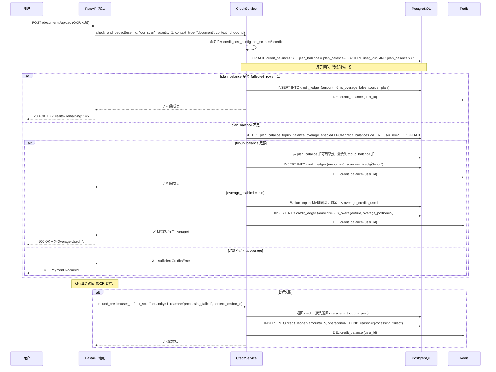
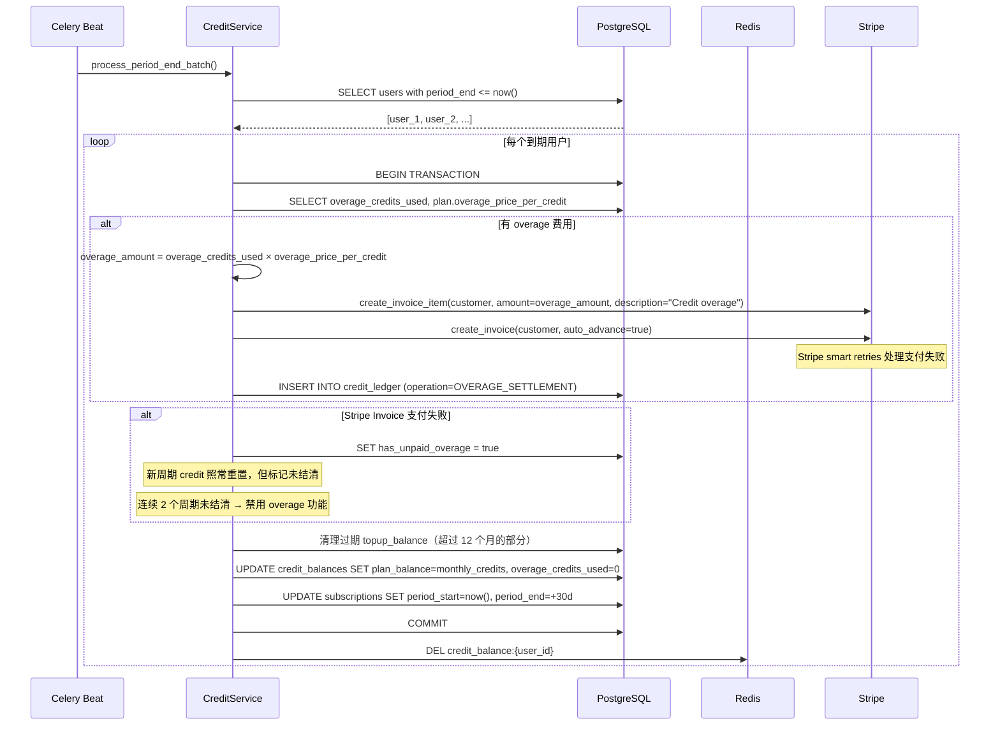
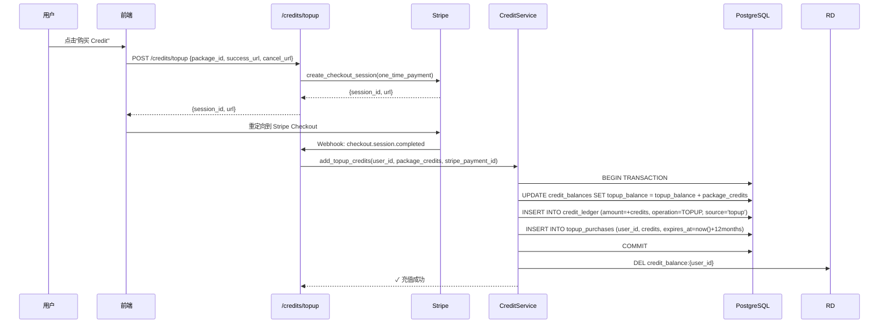

# 设计文档：Credit-Based Billing（基于 Credit 的计费系统）

## 概述

本设计将 Taxja 现有的"按资源类型配额"计费模型迁移为统一的"Credit/Token"计费模型。本文档为 **v1: Credit Billing Foundation**，专注于账务基础设施。后续 v2 将引入按处理深度和模式（Auto/High）的事件级 credit 扣费规则。

### v1 范围（本文档）

- Credit 余额管理（plan_balance + topup_balance 双余额）
- Credit Ledger 审计日志
- 月度重置（plan_balance 清零重置，topup_balance 保留）
- Top-up 充值（Stripe 一次性支付，purchased credits 有效期 12 个月）
- Overage 模式（Plus/Pro 可开启，月末 Stripe Invoice 结算）
- 失败退款机制（REFUND 操作）
- 并发安全（原子 UPDATE ... WHERE 或 SELECT FOR UPDATE）
- 前端套餐页 + Credit 展示改版
- 全局 credit_cost_config 配置（独立于 Plan）

### v2 范围（后续文档：AI Processing Pricing Model）

- Auto / High 处理模式差异计费
- 事件级扣费（document_base_processing, vision_page_processing, reasoning_escalation 等）
- 预估 → 保留 → 结算三段式计费
- 文档复杂度 / 页数 / escalation 的动态定价
- processing_mode 字段贯穿 API → Ledger → 前端

### 核心设计决策

1. **功能门控移除（用户侧）** — 不再按套餐锁定功能，所有功能纯 Credit 消耗。但系统侧仍保留处理级门控（如 create_asset_auto 的风险控制），这不是计费限制而是质量/风控限制。
2. **月度重置 + Top-up 保留** — Plan 赠送的 monthly credits 按周期重置不累积。Top-up 购买的 credits 独立存储，有效期 12 个月，不随月度周期清零。
3. **扣费顺序** — plan_balance → topup_balance → overage（如已开启）
4. **Overage 模式** — Plus/Pro 可开启，超额后按单价继续使用，周期结束 Stripe Invoice 结算。Free 不支持。
5. **失败退款** — 操作失败时写 REFUND ledger 记录退回 credit，不使用 hold/commit 模式（v1 简化）。
6. **全局 credit_costs** — 操作成本配置独立于 Plan，存为全局配置表。Plan 仅存 monthly_credits 和 overage_price_per_credit。v2 引入 Plan 级 override。
7. **v1 扣费粒度** — 仍按功能调用次数扣费（ocr_scan=5, ai_conversation=10 等），v2 再升级为事件级动态定价。
8. **不影响处理深度** — v1 仅改计费模型，OCR/AI/分类等处理逻辑不变。v2 将引入按处理深度和模式的 credit 扣费规则。

## 架构

```mermaid
graph TD
    subgraph Frontend
        A[SubscriptionStatus 组件] --> B[subscriptionStore]
        D[OverageToggle 组件] --> B
        E[CreditHistory 页面] --> B
        B --> C[API Client]
    end

    subgraph API Layer
        C --> F[/subscriptions/* 端点]
        C --> G[/credits/* 端点]
    end

    subgraph Service Layer
        F --> H[SubscriptionService]
        G --> I[CreditService]
        H --> I
        I --> CC[CreditCostConfig]
    end

    subgraph Data Layer
        I --> J[(PostgreSQL)]
        I --> K[(Redis Cache)]
        H --> J
    end

    subgraph External
        H --> L[Stripe API]
        I --> L
    end

    subgraph Background
        M[Celery Worker] --> I
        M --> H
    end
```


## 时序图

### Credit 消耗流程（含双余额 + Overage + 失败退款）



### 月度 Credit 重置 + Overage 结算流程



### Credit 充值（Top-up）流程



## 组件与接口

### 组件 1: CreditService（核心 Credit 管理服务）

**职责**:
- 管理双余额（plan_balance + topup_balance）的查询、扣除、充值
- 扣费顺序：plan_balance → topup_balance → overage
- 退款顺序：overage → topup_balance → plan_balance
- 处理 overage 逻辑（余额不足时检查 overage 开关）
- 维护 CreditLedger 审计日志
- Redis 缓存策略：写后删除（DEL），读时加载
- 月度重置 + overage 结算 + topup 过期清理
- 并发安全：原子 UPDATE ... WHERE 或 SELECT ... FOR UPDATE

**接口**:
```python
class CreditService:
    def __init__(self, db: Session, redis_client: Optional[redis.Redis] = None): ...

    def get_balance(self, user_id: int) -> CreditBalanceInfo:
        """返回 plan_balance, topup_balance, overage 状态, 预估 overage 费用"""
        ...

    def check_and_deduct(
        self,
        user_id: int,
        operation: str,
        quantity: int = 1,
        context_type: Optional[str] = None,  # "document", "conversation", "transaction" 等
        context_id: Optional[int] = None,
    ) -> CreditDeductionResult:
        """
        扣除 credit。扣费顺序: plan_balance → topup_balance → overage。
        并发安全: 使用 UPDATE ... WHERE balance >= cost 原子操作。
        余额全部不足且 overage 未开启 → InsufficientCreditsError

        内部使用统一 helper 方法:
        - has_settled_charge_for_context(user_id, operation, context_type, context_id) — 防重复扣费
        - has_refund_for_key(user_id, refund_key) — 防重复退款
        这些 helper 供所有端点和 Celery task 复用，不散落在各处。
        """
        ...

    def refund_credits(
        self,
        user_id: int,
        operation: str,
        quantity: int = 1,
        reason: str = "processing_failed",
        context_type: Optional[str] = None,
        context_id: Optional[int] = None,
        refund_key: Optional[str] = None,
    ) -> CreditBalanceInfo:
        """
        操作失败时退回 credit。退款顺序: overage → topup → plan。
        写 REFUND ledger 记录。

        幂等保证：如果提供 refund_key，则通过 reference_id 做幂等检查——
        若已存在相同 refund_key 的 REFUND ledger 记录，直接返回当前余额，不重复退款。
        异步场景（Celery retry / on_failure 重入）必须传 refund_key 防止多退。
        """
        ...

    def check_sufficient(
        self, user_id: int, operation: str, quantity: int = 1,
        allow_overage: bool = True,
    ) -> bool:
        """
        检查是否有足够 credit。
        allow_overage=True: plan + topup + overage 综合判断（默认）
        allow_overage=False: 仅检查 plan + topup 自然余额，不考虑 overage
        用途：套餐页预估、高风险操作不希望走 overage 时传 False
        """
        ...

    def add_topup_credits(
        self, user_id: int, amount: int, stripe_payment_id: str
    ) -> CreditBalanceInfo:
        """充值 top-up credits，记录购买和过期时间"""
        ...

    def set_overage_enabled(self, user_id: int, enabled: bool) -> CreditBalanceInfo:
        """
        开启/关闭 overage。
        Free 套餐 → OverageNotAvailableError
        has_unpaid_overage 连续 2 周期 → OverageSuspendedError
        """
        ...

    def process_period_end(self, user_id: int) -> PeriodEndResult:
        """
        月度重置。严格按以下顺序执行（在单个数据库事务内）：
        1. 结算 overage（计算费用，创建 Stripe Invoice with metadata type=overage_settlement）
        2. 清理过期 topup（逐笔检查 TopupPurchase，标记 is_expired，扣减 topup_balance）
        3. 重置 plan_balance = monthly_credits
        4. 清零 overage_credits_used = 0
        5. 更新 subscription 周期日期（period_start, period_end）
        6. 写入 Ledger 记录（OVERAGE_SETTLEMENT / TOPUP_EXPIRY / MONTHLY_RESET）
        7. COMMIT 事务
        8. 删除 Redis 缓存 key（事务外）
        """
        ...

    def get_ledger(
        self, user_id: int, limit: int = 50, offset: int = 0
    ) -> List[CreditLedgerEntry]:
        """获取 credit 变动历史"""
        ...

    def get_credit_costs(self) -> Dict[str, int]:
        """获取全局操作 credit 成本表"""
        ...

    def estimate_cost(
        self,
        user_id: int,
        operation: str,
        quantity: int = 1,
    ) -> CreditEstimateResult:
        """
        预估操作成本。v1 为静态查表，返回 cost、是否充足、是否会走 overage。
        v2 扩展为动态预估（文档复杂度、处理模式等）。

        ⚠️ 纯只读操作：不创建 ledger、不写缓存、不保留/冻结余额、无任何副作用。
        """
        ...
```

**关键数据类型**:
```python
@dataclass
class CreditBalanceInfo:
    plan_balance: int               # 套餐余额（月度重置）
    topup_balance: int              # 充值余额（12 个月有效）
    total_balance: int              # plan + topup 总余额
    available_without_overage: int  # plan + topup 自然余额（不含 overage 额度）
    monthly_credits: int            # 套餐月度额度
    overage_enabled: bool           # overage 开关
    overage_credits_used: int       # 本周期已用 overage credits
    overage_price_per_credit: Optional[Decimal]  # overage 单价
    estimated_overage_cost: Decimal # 预估 overage 费用
    has_unpaid_overage: bool        # 是否有未结清 overage
    reset_date: Optional[datetime]  # 下次重置日期

@dataclass
class CreditDeductionResult:
    success: bool
    plan_deducted: int              # 从 plan_balance 扣除的部分
    topup_deducted: int             # 从 topup_balance 扣除的部分
    overage_portion: int            # 计入 overage 的部分
    total_deducted: int             # 总扣除量
    balance_after: CreditBalanceInfo

@dataclass
class PeriodEndResult:
    overage_settled: bool
    overage_amount: Optional[Decimal]
    stripe_invoice_id: Optional[str]
    topup_expired: int              # 过期清理的 topup credits
    new_plan_balance: int

@dataclass
class CreditEstimateResult:
    operation: str
    cost: int                       # 操作总成本
    sufficient: bool                # 是否有足够余额（含 overage）
    sufficient_without_overage: bool # 仅自然余额是否足够
    would_use_overage: bool         # 是否会动用 overage
```

### 组件 2: CreditCostConfig（全局成本配置）

**职责**:
- 存储全局操作 credit 成本（独立于 Plan）
- 支持版本化（pricing_version），便于调价时追溯
- v2 扩展点：支持 Plan 级 override

```python
class CreditCostConfig(Base):
    __tablename__ = "credit_cost_configs"

    id = Column(Integer, primary_key=True, index=True)
    operation = Column(String(50), nullable=False, unique=True, index=True)
    # e.g., "ocr_scan", "ai_conversation", "transaction_entry", "bank_import", "e1_generation", "tax_calc"
    credit_cost = Column(Integer, nullable=False)
    description = Column(String(200), nullable=True)
    pricing_version = Column(Integer, nullable=False, default=1)
    is_active = Column(Boolean, nullable=False, default=True)
    updated_at = Column(DateTime, nullable=False, default=datetime.utcnow, onupdate=datetime.utcnow)
```

**初始配置**:

| operation | credit_cost | description |
|-----------|-------------|-------------|
| ocr_scan | 5 | 文档 OCR 扫描识别 |
| ai_conversation | 10 | AI 税务助手对话 |
| transaction_entry | 1 | 交易录入 |
| bank_import | 3 | 银行对账单导入（每笔） |
| e1_generation | 20 | E1 表格生成 |
| tax_calc | 2 | 税务计算 |

### 组件 3: Plan 模型扩展

```python
class Plan(Base):
    # ... 现有字段保留（plan_type, name, monthly_price, yearly_price, features, quotas）...
    monthly_credits = Column(Integer, nullable=False, default=0)
    overage_price_per_credit = Column(Numeric(6, 4), nullable=True)
    # None = 不支持 overage (Free)
```

**套餐配置**:

| 套餐 | 月度 Credits | Overage 单价 | 月价 |
|------|-------------|-------------|------|
| Free | 50 | 不支持 | €0 |
| Plus | 500 | €0.04 | €9.99 |
| Pro  | 2000 | €0.03 | €24.99 |

### 组件 4: Credit API 端点

```python
router = APIRouter(prefix="/credits", tags=["credits"])

@router.get("/balance")              # 获取 plan_balance + topup_balance + overage 状态
@router.get("/history")              # 获取 Credit 变动历史（分页）
@router.get("/costs")                # 获取全局操作 credit 成本表
@router.post("/topup")               # 创建 Credit 充值 Checkout
@router.put("/overage")              # 开启/关闭 overage 模式
@router.get("/overage/estimate")     # 获取当前 overage 预估费用
@router.post("/estimate")            # 预估操作成本（v1 静态查表，v2 扩展为动态预估）
```

### 组件 5: FeatureGateService 迁移

**现有行为（移除用户侧门控）**:
- `_FEATURE_MIN_PLAN` 映射：Feature → 最低 PlanType
- `check_feature_access()` 基于套餐层级判断

**新行为**:
- 用户侧：`check_feature_access()` 改为检查 credit 是否充足（plan + topup + overage）
- 系统侧：保留处理级门控（风险控制、质量控制），这不是计费限制

```python
class FeatureGateService:
    """
    v1 迁移：用户侧功能通过 credit 控制，系统侧保留处理级门控。

    重要边界：
    - FeatureGateService 只负责用户侧 entitlement / payment sufficiency
    - 自动化深度、risk gating、manual review 继续由处理级 gate 决定，不迁移到 credit 层
    - 例如：用户有足够 credit 可以使用资产识别，但 create_asset_auto 可能因字段不全/重复风险/review_reasons 被系统侧 gate 拒绝
    """

    def check_feature_access(self, user_id: int, feature: str) -> bool:
        """用户是否能使用某功能 = 有足够 credit 或 overage 已开启"""
        credit_service = CreditService(self.db, self.redis_client)
        return credit_service.check_sufficient(user_id, feature, quantity=1)

    def check_processing_gate(self, user_id: int, gate: str) -> bool:
        """
        系统侧处理级门控（风控/质量），与计费无关。
        例如 create_asset_auto 需要额外的风险评估。
        这里的逻辑不变，不受 credit 制影响。
        """
        ...
```

### 组件 6: 前端 Credit 展示

**职责**:
- 替换 SubscriptionStatus 中的按资源使用量条为统一 Credit 进度条（显示 plan + topup）
- 新增 Overage 开关（toggle）+ 单价显示 + 未结清警告
- 新增 Credit 历史页面
- 新增 Credit 充值入口
- 套餐页改为展示月度 Credit 额度 + overage 单价 + 操作成本参考
- 新增"预计能做什么"辅助文案：根据当前余额和 CreditCostConfig 显示近似估算（如"约等于还能处理 N 次 OCR"），并标注"该提示为按当前标准成本表的近似估算，不代表最终实际消耗"


## 数据模型

### CreditBalance（新增表）

```python
class CreditBalance(Base):
    __tablename__ = "credit_balances"

    id = Column(Integer, primary_key=True, index=True)
    user_id = Column(Integer, ForeignKey("users.id", ondelete="CASCADE"),
                     nullable=False, unique=True, index=True)
    plan_balance = Column(Integer, nullable=False, default=0)       # 套餐余额（月度重置）
    topup_balance = Column(Integer, nullable=False, default=0)      # 充值余额（12 个月有效）
    overage_enabled = Column(Boolean, nullable=False, default=False)
    overage_credits_used = Column(Integer, nullable=False, default=0)
    has_unpaid_overage = Column(Boolean, nullable=False, default=False)
    unpaid_overage_periods = Column(Integer, nullable=False, default=0)  # 连续未结清周期数
    updated_at = Column(DateTime, nullable=False, default=datetime.utcnow,
                        onupdate=datetime.utcnow)

    user = relationship("User", back_populates="credit_balance")
```

**CHECK 约束**:
- `plan_balance >= 0`
- `topup_balance >= 0`
- `overage_credits_used >= 0`
- `unpaid_overage_periods >= 0`

### CreditLedger（新增表）

```python
class CreditOperation(str, Enum):
    DEDUCTION = "deduction"
    REFUND = "refund"                       # 操作失败退款
    MONTHLY_RESET = "monthly_reset"
    TOPUP = "topup"
    TOPUP_EXPIRY = "topup_expiry"           # top-up 过期清理
    OVERAGE_SETTLEMENT = "overage_settlement"
    ADMIN_ADJUSTMENT = "admin_adjustment"
    MIGRATION = "migration"

class CreditSource(str, Enum):
    PLAN = "plan"
    TOPUP = "topup"
    OVERAGE = "overage"
    MIXED = "mixed"     # 跨余额扣除

class CreditLedgerStatus(str, Enum):
    SETTLED = "settled"           # 已结算（v1 默认状态）
    RESERVED = "reserved"        # 已冻结未结算（v2 reservation 用）
    REVERSED = "reversed"        # 已撤销
    FAILED = "failed"            # 操作失败
    # v1 中 failed 仅用于明确记录已进入扣费流程但最终未落账成功的异常场景；
    # 普通业务异常（如 InsufficientCreditsError）不写 failed ledger，
    # 仅当已产生部分持久化副作用（如 DB 写入部分成功）时才记录 failed。

class CreditLedger(Base):
    __tablename__ = "credit_ledger"

    id = Column(Integer, primary_key=True, index=True)
    user_id = Column(Integer, ForeignKey("users.id", ondelete="CASCADE"),
                     nullable=False, index=True)
    operation = Column(SQLEnum(CreditOperation), nullable=False, index=True)
    operation_detail = Column(String(100), nullable=True)
    # e.g., "ocr_scan", "ai_conversation", "transaction_entry"
    status = Column(SQLEnum(CreditLedgerStatus), nullable=False,
                    default=CreditLedgerStatus.SETTLED, index=True)
    # v1 所有记录默认 settled；v2 reservation 流程使用 reserved → settled/reversed
    credit_amount = Column(Integer, nullable=False)       # 正数=充入, 负数=扣除
    source = Column(SQLEnum(CreditSource), nullable=False, default=CreditSource.PLAN)
    plan_balance_after = Column(Integer, nullable=False)   # 操作后 plan 余额
    topup_balance_after = Column(Integer, nullable=False)  # 操作后 topup 余额
    is_overage = Column(Boolean, nullable=False, default=False)
    overage_portion = Column(Integer, nullable=False, default=0)
    context_type = Column(String(50), nullable=True)       # "document", "conversation", "transaction", "tax_form"
    context_id = Column(Integer, nullable=True)            # 关联实体 ID
    reference_id = Column(String(255), nullable=True)      # Stripe payment/invoice ID
    reservation_id = Column(String(255), nullable=True)    # v2 预扣链路关联 ID（v1 预留，始终为 null）
    reason = Column(String(200), nullable=True)            # 退款原因等
    pricing_version = Column(Integer, nullable=False, default=1)  # 使用的定价规则版本
    created_at = Column(DateTime, nullable=False, default=datetime.utcnow, index=True)

    user = relationship("User")
```

**CHECK 约束**:
- `credit_amount != 0`
- `plan_balance_after >= 0`
- `topup_balance_after >= 0`
- `overage_portion >= 0`

**索引**:
- `(user_id, created_at DESC)` — 用户历史查询
- `(user_id, operation)` — 按操作类型筛选
- `(context_type, context_id)` — 按关联实体查询
- `(status)` — 按状态筛选

**部分唯一索引**:
- `UNIQUE (user_id, reference_id) WHERE operation = 'refund' AND reference_id IS NOT NULL` — 确保 refund_key 幂等在数据库层面强制执行

### TopupPurchase（新增表，追踪 top-up 有效期）

```python
class TopupPurchase(Base):
    __tablename__ = "topup_purchases"

    id = Column(Integer, primary_key=True, index=True)
    user_id = Column(Integer, ForeignKey("users.id", ondelete="CASCADE"),
                     nullable=False, index=True)
    credits_purchased = Column(Integer, nullable=False)
    credits_remaining = Column(Integer, nullable=False)    # 剩余未消耗
    price_paid = Column(Numeric(10, 2), nullable=False)
    stripe_payment_id = Column(String(255), nullable=True)
    purchased_at = Column(DateTime, nullable=False, default=datetime.utcnow)
    expires_at = Column(DateTime, nullable=False)          # purchased_at + 12 months
    is_expired = Column(Boolean, nullable=False, default=False)

    user = relationship("User")
```

### CreditTopupPackage（新增表）

```python
class CreditTopupPackage(Base):
    __tablename__ = "credit_topup_packages"

    id = Column(Integer, primary_key=True, index=True)
    name = Column(String(100), nullable=False)
    credits = Column(Integer, nullable=False)
    price = Column(Numeric(10, 2), nullable=False)
    stripe_price_id = Column(String(255), nullable=True)
    is_active = Column(Boolean, nullable=False, default=True)
    created_at = Column(DateTime, nullable=False, default=datetime.utcnow)
```

**充值包**:

| 包名 | Credits | 价格 | 单价 |
|------|---------|------|------|
| 小包 | 100 | €4.99 | €0.050 |
| 中包 | 300 | €12.99 | €0.043 |
| 大包 | 1000 | €39.99 | €0.040 |

### Plan 模型扩展

```python
# 新增字段到现有 Plan 模型
monthly_credits = Column(Integer, nullable=False, default=0)
overage_price_per_credit = Column(Numeric(6, 4), nullable=True)  # None = 不支持 overage
# 注意：credit_costs 不在 Plan 里，而是在全局 CreditCostConfig 表
```

## 并发控制策略

### 扣费并发安全

两个并发请求同时扣费时，必须保证不会出现余额变负数。

**方案：原子 UPDATE + 行级锁**

```sql
-- 快速路径：plan_balance 足够时，单条原子 UPDATE
UPDATE credit_balances
SET plan_balance = plan_balance - :cost,
    updated_at = now()
WHERE user_id = :user_id AND plan_balance >= :cost;

-- 如果 affected_rows = 0（plan_balance 不足），进入慢路径
-- 慢路径：SELECT FOR UPDATE 加行锁，计算跨余额扣除
SELECT plan_balance, topup_balance, overage_enabled, overage_credits_used
FROM credit_balances
WHERE user_id = :user_id
FOR UPDATE;

-- 然后在事务内计算分配并 UPDATE
```

**规则**:
- 快速路径（plan_balance 足够）：单条 UPDATE，无需显式锁
- 慢路径（需跨余额或 overage）：SELECT FOR UPDATE 加行锁
- 所有扣费操作在数据库事务内完成
- Redis 缓存写后删除（DEL），不做 DECRBY

### Redis 缓存一致性

- **写后删除**：DB 写成功后 DEL 缓存 key，不做增量更新
- **读时加载**：cache miss 时从 DB 加载，SET 缓存（TTL 5 分钟）
- **代价**：每次扣费后下一次读取多一次 DB 查询
- **收益**：缓存永远不会比 DB 高，避免超额扣除

## Overage 详细设计

### Overage 开关规则

1. **Free 套餐**: 不允许开启 → `OverageNotAvailableError`
2. **Plus/Pro 套餐**: 默认关闭，用户手动开启
3. **套餐降级到 Free**: 自动关闭 overage，结算已有 overage 费用
4. **套餐升级**: overage 开关状态保留
5. **未结清 overage**: 连续 2 个周期未结清 → 自动禁用 overage（`OverageSuspendedError`），已有 credit 仍可使用

### Overage 支付失败处理

1. Stripe Invoice 创建时设置 `auto_advance=true`，依赖 Stripe smart retries（自动重试 3-4 次，间隔递增，通常跨 7-10 天）
2. 我方不做额外重试逻辑，完全依赖 Stripe 的 smart retry 机制
3. 新周期 credit **照常重置**（不影响用户体验）
4. Stripe webhook `invoice.payment_failed` → 标记 `has_unpaid_overage = true`，`unpaid_overage_periods += 1`
5. `unpaid_overage_periods >= 2` → 自动禁用 overage 功能，用户仍可使用 plan + topup 余额，但不能再产生 overage
6. 用户结清欠款后（Stripe webhook: `invoice.paid`）→ **仅当该 paid invoice 对应 outstanding overage settlement 时**才重置 `has_unpaid_overage = false` 和 `unpaid_overage_periods = 0`，恢复 overage 功能。普通订阅付款成功不应错误清空 overage 欠费状态（通过 invoice metadata 中的 `type=overage_settlement` 标识区分）
7. 不阻止用户继续使用平台（只禁用 overage，不冻结账户）

### Overage 前端展示

正常状态（有余额）:
```
┌─────────────────────────────────────────────┐
│  Credits                                     │
│  Plan:   ████████████░░░░░░  320 / 500      │
│  Top-up: ██░░░░░░░░░░░░░░░   45 remaining   │
│                                              │
│  ┌─────────────────────────────────────────┐ │
│  │ ⚡ Overages Enabled                  🔘 │ │
│  │ Keep using Taxja past your monthly      │ │
│  │ limit. €0.04 per additional Credit.     │ │
│  └─────────────────────────────────────────┘ │
│                                              │
│  This period's overage: 0 credits (€0.00)   │
└─────────────────────────────────────────────┘
```

Overage 已产生:
```
┌─────────────────────────────────────────────┐
│  Credits                                     │
│  Plan:   ████████████████████  500 / 500    │
│  Top-up: ████████████████████   0 remaining  │
│  + 47 overage credits                        │
│                                              │
│  ⚡ Overages Enabled                     🔘  │
│  This period's overage: 47 credits (€1.88)  │
│  ⚠️ Billed at period end                     │
└─────────────────────────────────────────────┘
```

## 前端套餐页改版

```
┌──────────────┬──────────────┬──────────────┐
│    Free      │    Plus      │     Pro      │
│   €0/月      │   €9.99/月   │  €24.99/月   │
│              │              │              │
│  50 Credits  │ 500 Credits  │ 2000 Credits │
│   /月        │   /月        │    /月       │
│              │              │              │
│ No overage   │ Overage:     │ Overage:     │
│              │ €0.04/credit │ €0.03/credit │
│              │              │              │
│ Top-up 可用  │ Top-up 可用  │ Top-up 可用  │
│ (12 个月有效)│ (12 个月有效)│ (12 个月有效)│
│              │              │              │
│ [开始使用]   │  [订阅]      │   [订阅]     │
└──────────────┴──────────────┴──────────────┘

操作成本参考：
  OCR 扫描: 5 credits    AI 对话: 10 credits
  交易录入: 1 credit     银行导入: 3 credits
  E1 生成: 20 credits    税务计算: 2 credits
```

## 失败退款机制

### 策略：先扣后退（Refund on Failure）

v1 采用简单的先扣后退模式，不使用 hold/commit（v2 引入预估/保留/结算三段式）。

### 退款流程

1. 操作开始前扣除 credit
2. 操作执行
3. 如果失败 → 调用 `refund_credits()` 退回
4. Ledger 记录 `operation=REFUND`，`reason` 字段说明原因

### 退款顺序（与扣费相反）

1. 先退回 overage 部分（减少 `overage_credits_used`）
2. 再退回 topup_balance
3. 最后退回 plan_balance

### Top-up 消耗规则：FIFO

当扣费需要动用 topup_balance 时，按 `purchased_at ASC`（先购先消）顺序从 TopupPurchase 记录中扣减 `credits_remaining`。

- 每次扣费从最早购买且 `credits_remaining > 0` 的 TopupPurchase 开始消耗
- 过期清理同样逐笔检查：`expires_at < now()` 的 TopupPurchase 标记 `is_expired=true`，从 `topup_balance` 扣除其 `credits_remaining`
- `topup_balance` 是所有未过期 TopupPurchase 的 `credits_remaining` 聚合值，不独立维护（或作为缓存值，以 TopupPurchase 明细为准）

### 退款触发场景

| 场景 | reason |
|------|--------|
| OCR 处理失败（文件损坏/格式不支持） | `ocr_processing_failed` |
| OCR 服务超时 | `ocr_service_timeout` |
| AI 对话 API 错误 | `ai_service_error` |
| E1 生成失败 | `e1_generation_failed` |
| 银行导入解析失败 | `bank_import_failed` |

## 迁移策略

### 数据迁移

1. 为所有现有用户创建 `CreditBalance` 记录
2. `plan_balance = plan.monthly_credits`（直接给满额，不做折算）
3. `topup_balance = 0`
4. `overage_enabled = false`
5. Ledger 记录 `operation=MIGRATION`
6. 创建全局 `CreditCostConfig` 初始数据

### 为什么不做折算

迁移时直接给满额而不按已用配额折算。原因：
- 旧系统按资源类型有不同配额（30 transactions, 20 OCR scans），折算公式不直观
- 用户可能在周期中间迁移，折算后感觉"额度变少了"
- 迁移时用户体验优先级高于几块钱的成本差异

### 向后兼容

- 旧 `UsageRecord` 表暂时保留，不删除（后续版本清理）
- 旧 `quotas` JSONB 字段保留但不再使用
- 旧 `features` JSONB 字段保留但不再用于功能门控
- API 响应过渡期同时返回 credit 信息和旧格式

## v2 预留接口

以下字段和接口在 v1 中预留，v2 实现：

- `CreditLedger.status` — v1 所有记录默认 `settled`，v2 用于 reservation 流程（reserved → settled/reversed）
- `CreditLedger.reservation_id` — v1 始终为 null，v2 用于预扣链路关联
- `CreditLedger.pricing_version` — 已在 v1 schema 中，v2 用于追踪定价规则版本
- `CreditCostConfig.pricing_version` — 已在 v1 schema 中，v2 用于版本化定价
- `context_type` + `context_id` — 已在 v1 Ledger 中，v2 用于事件级关联
- `CreditService.estimate_cost()` — v1 实现静态查表版本，v2 扩展为动态预估（文档复杂度、处理模式等）
- `CreditService.reserve_credits()` — v2 新增，冻结 credit
- `CreditService.finalize_charge()` — v2 新增，最终结算
- `CreditService.release_reserved()` — v2 新增，释放冻结
- `CreditLedger.processing_mode` — v2 新增字段（auto/high）
- `CreditLedger.cost_breakdown_json` — v2 新增字段
- Plan 级 credit_cost override — v2 支持套餐差异化定价


## v1 明确不做的事项（Non-goals）

以下功能明确不在 v1 范围内，避免范围蔓延和团队误解：

1. **不按文档复杂度动态定价** — v1 所有操作按 CreditCostConfig 静态配置扣费，不区分文档页数、图片数量、字段复杂度
2. **不支持 Auto / High 处理模式差异扣费** — v1 不引入 processing_mode 概念，所有处理走统一成本
3. **不支持 reservation-based settlement** — v1 采用"先扣后退"模式，不实现 reserve → settle → release 三段式（但 Ledger 已预留 status 和 reservation_id 字段供 v2 使用）
4. **不按实际 token / vision API 调用回写真实成本** — v1 不追踪 AI provider 的实际消耗，成本为固定值
5. **不针对单个后台任务做多段扣费** — v1 每次操作扣费一次，不拆分为多个计费事件
6. **不改变 AI 处理深度** — v1 仅改计费模型，OCR/AI/分类等处理逻辑和结果质量不变
7. **不支持 Plan 级 credit_cost override** — v1 所有套餐共享全局 CreditCostConfig，v2 支持差异化定价
8. **成本配置不区分 provider path** — 不区分 Tesseract vs Cloud Vision、本地 AI vs OpenAI 等不同处理路径的成本差异

## Correctness Properties

*属性（Property）是指在系统所有合法执行中都应成立的特征或行为——本质上是对系统应做什么的形式化陈述。属性是人类可读规格与机器可验证正确性保证之间的桥梁。*

### Property 1: total_balance 不变量

*For any* CreditBalance 记录，get_balance 返回的 total_balance 始终等于 plan_balance + topup_balance。

**Validates: Requirement 1.2**

### Property 2: 扣费分配守恒

*For any* 扣费操作，给定初始 plan_balance、topup_balance 和 overage_enabled 状态，扣费后 plan_deducted + topup_deducted + overage_portion 始终等于操作的总 credit 成本（cost × quantity），且扣费严格遵循 plan → topup → overage 顺序：仅当 plan_balance 不足时才动用 topup_balance，仅当 plan_balance 和 topup_balance 均不足时才计入 overage。

**Validates: Requirements 2.2, 2.3, 2.4**

### Property 3: 余额不足拒绝

*For any* 用户，当 plan_balance + topup_balance 小于操作成本且 overage_enabled 为 false 时，check_and_deduct 始终抛出 InsufficientCreditsError，且 plan_balance 和 topup_balance 保持不变。

**Validates: Requirement 2.5**

### Property 4: 扣费-退款 round trip

*For any* 成功的扣费操作，如果随后对同一操作执行 refund_credits，退款后的 plan_balance + topup_balance + overage_credits_used 应恢复到扣费前的状态。

**Validates: Requirements 3.1, 3.2, 3.3, 3.4**

### Property 5: 退款顺序与扣费相反

*For any* 退款操作，退款分配严格遵循 overage → topup → plan 顺序：仅当 overage 部分已全部退回时才退回 topup_balance，仅当 overage 和 topup 部分均已退回时才退回 plan_balance。

**Validates: Requirements 3.2, 3.3, 3.4**

### Property 6: 每次余额变动都有 Ledger 记录

*For any* 导致 CreditBalance 变化的操作（扣费、退款、月度重置、充值、过期清理），CreditLedger 中应新增至少一条记录，且该记录的 plan_balance_after 和 topup_balance_after 与操作后的实际余额一致。

**Validates: Requirements 2.6, 3.5, 5.5, 5.6, 6.4**

### Property 7: Free 套餐不支持 overage

*For any* Free 套餐用户（overage_price_per_credit 为 null），调用 set_overage_enabled(true) 始终抛出 OverageNotAvailableError，且 overage_enabled 保持 false。

**Validates: Requirements 4.1, 13.2**

### Property 8: 套餐变更对 overage 的影响

*For any* 用户，当套餐从 Plus/Pro 降级到 Free 时，overage_enabled 变为 false；当套餐升级（Free→Plus、Plus→Pro 等）时，overage_enabled 保持升级前的值不变。

**Validates: Requirements 4.3, 4.4**

### Property 9: Overage 费用计算

*For any* 计费周期结束时 overage_credits_used > 0 的用户，overage 结算金额始终等于 overage_credits_used × overage_price_per_credit。

**Validates: Requirements 4.5, 10.6**

### Property 10: 连续未结清自动禁用 overage

*For any* 用户，当 unpaid_overage_periods >= 2 时，调用 set_overage_enabled(true) 始终抛出 OverageSuspendedError，且 overage_enabled 保持 false。

**Validates: Requirement 4.7**

### Property 11: 月度重置行为

*For any* 用户，执行 process_period_end 后，plan_balance 等于套餐的 monthly_credits，overage_credits_used 等于 0，且 topup_balance 中未过期的部分保持不变。

**Validates: Requirements 5.1, 5.2, 5.3**

### Property 12: Topup 过期清理

*For any* TopupPurchase 记录，当 expires_at 早于当前时间时，process_period_end 应将其标记为 is_expired=true，并从 topup_balance 中扣除对应的 credits_remaining。

**Validates: Requirement 5.4**

### Property 13: 充值增加 topup_balance

*For any* 充值操作，充值后 topup_balance 应等于充值前 topup_balance 加上购买的 credit 数量，且对应的 TopupPurchase 记录的 expires_at 等于 purchased_at 加 12 个月。

**Validates: Requirements 6.2, 6.3**

### Property 14: 扣费金额等于配置成本

*For any* 扣费操作，实际扣除的总 credit 数量始终等于 CreditCostConfig 中该操作的 credit_cost × quantity，且 Ledger 记录的 pricing_version 等于扣费时 CreditCostConfig 的 pricing_version。

**Validates: Requirements 2.1, 7.2, 7.3**

### Property 15: 成本列表仅返回活跃配置

*For any* CreditCostConfig 数据集，get_credit_costs 返回的列表仅包含 is_active=true 的记录，且不遗漏任何活跃记录。

**Validates: Requirements 7.5, 10.3**

### Property 16: 并发扣费余额不为负

*For any* 一组并发扣费操作，执行完毕后 plan_balance >= 0 且 topup_balance >= 0，且所有成功扣费的总量不超过初始 plan_balance + topup_balance + 允许的 overage 额度。

**Validates: Requirement 8.3**

### Property 17: FeatureGateService 委托 CreditService

*For any* 用户和功能，FeatureGateService.check_feature_access 的返回值与 CreditService.check_sufficient 的返回值一致。

**Validates: Requirements 9.1, 9.3, 9.4**

### Property 18: 历史分页正确性

*For any* 用户的 Ledger 查询，返回的记录数量不超过 limit 参数，记录按 created_at 降序排列，且 offset 跳过的记录数正确。

**Validates: Requirement 10.2**

### Property 19: 迁移后状态正确性

*For any* 迁移前的用户，迁移后其 CreditBalance 的 plan_balance 等于对应套餐的 monthly_credits，topup_balance 等于 0，overage_enabled 等于 false，且 CreditLedger 中存在一条 operation=MIGRATION 的记录。

**Validates: Requirements 12.1, 12.2, 12.3**
