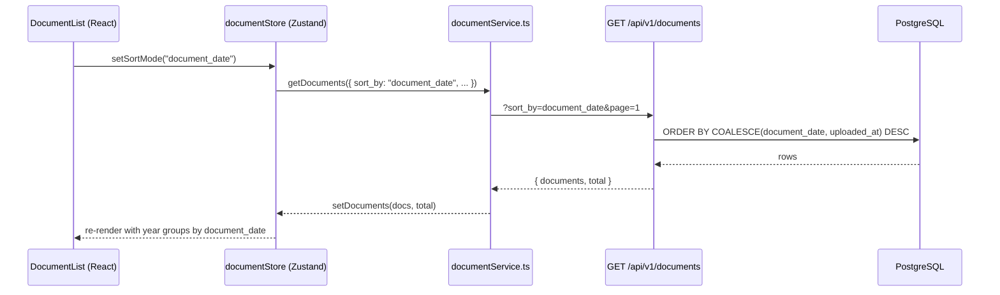
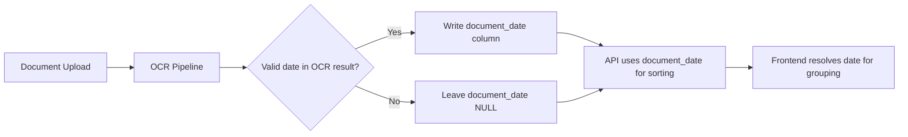

# Design Document: Document Sort by Date

## Overview

This feature adds the ability to sort and group documents by their OCR-extracted document date (invoice date, receipt date, etc.) in addition to the existing upload date sorting. The change flows through three layers:

1. **Database**: A new materialized `document_date` column on the `documents` table, populated during OCR processing and backfilled for existing rows.
2. **Backend API**: A `sort_by` query parameter on `GET /api/v1/documents` and `GET /api/v1/documents/export-zip` that switches ordering and date-range filtering between `uploaded_at` and `document_date`.
3. **Frontend**: A `SortModeSelector` control in `DocumentList`, a `resolveDocumentDate` utility, updated year-grouping logic, and localStorage persistence of the user's preference.

The design preserves full backward compatibility: when `sort_by` is omitted, every endpoint behaves identically to today.

## Architecture



### Data Flow for `document_date` Population



## Components and Interfaces

### Backend

#### 1. Document Model Change (`backend/app/models/document.py`)

Add a nullable `document_date` column after `processed_at`:

```python
from sqlalchemy import Date
# ...
document_date = Column(Date, nullable=True, index=True)
```

Using `Date` (not `DateTime`) because document dates from OCR are calendar dates without time components. An index is added because the column is used in `ORDER BY` and `WHERE` clauses.

#### 2. Alembic Migration (`backend/alembic/versions/072_add_document_date_column.py`)

- Adds `document_date DATE NULL` column to `documents`.
- Creates index `ix_documents_document_date` on the new column.
- Runs a data backfill step that iterates existing rows with non-null `ocr_result` and extracts the resolved date using the priority chain: `document_date` → `date` → `invoice_date` → `receipt_date` → `purchase_date` → `start_date`.
- The backfill uses batched `UPDATE` statements (500 rows per batch) to avoid long-running locks.

#### 3. OCR Pipeline Integration (`backend/app/tasks/ocr_tasks.py`)

After OCR processing writes `ocr_result`, a helper `resolve_document_date(ocr_result)` extracts the date using the priority chain and writes it to `document.document_date`. This function is also used by the migration backfill.

```python
# New utility in backend/app/services/document_date_resolver.py
from datetime import date
from typing import Any, Optional

DATE_FIELD_PRIORITY = [
    "document_date", "date", "invoice_date",
    "receipt_date", "purchase_date", "start_date",
]

def resolve_document_date(ocr_result: Optional[dict[str, Any]]) -> Optional[date]:
    """Extract the best document date from OCR result using priority chain."""
    if not ocr_result or not isinstance(ocr_result, dict):
        return None
    for field in DATE_FIELD_PRIORITY:
        value = ocr_result.get(field)
        if value and isinstance(value, str):
            try:
                return date.fromisoformat(value[:10])
            except (ValueError, TypeError):
                continue
    return None
```

#### 4. Documents API (`GET /api/v1/documents`)

Add `sort_by` query parameter:

```python
from enum import Enum

class SortByOption(str, Enum):
    upload_date = "upload_date"
    document_date = "document_date"

@router.get("", response_model=DocumentList)
def get_documents(
    # ... existing params ...
    sort_by: Optional[SortByOption] = Query(None),
):
```

Ordering logic:
- `sort_by=upload_date` (or omitted): `ORDER BY uploaded_at DESC` (current behavior)
- `sort_by=document_date`: `ORDER BY COALESCE(document_date, uploaded_at) DESC`

Date-range filter logic when `sort_by=document_date`:
- `start_date` / `end_date` filters apply against `COALESCE(document_date, uploaded_at)` instead of `uploaded_at`.

#### 5. Export ZIP API (`GET /api/v1/documents/export-zip`)

Add `sort_by` query parameter with same `SortByOption` enum.

- `sort_by` omitted: flat file list (current behavior, no year subfolders).
- `sort_by=upload_date`: files placed in `{year}/` subfolders based on `uploaded_at`.
- `sort_by=document_date`: files placed in `{year}/` subfolders based on `document_date`, with `unknown/` for documents where `document_date` is NULL.

Duplicate filenames within the same folder get a numeric suffix (`invoice_1.pdf`).

#### 6. Pydantic Schema Update (`backend/app/schemas/document.py`)

Add `document_date: Optional[date]` to `DocumentDetail` so the frontend receives the materialized date.

### Frontend

#### 7. Sort Mode Type & Store (`frontend/src/stores/documentStore.ts`)

```typescript
type SortMode = 'upload_date' | 'document_date';

interface DocumentState {
  // ... existing fields ...
  sortMode: SortMode;
  setSortMode: (mode: SortMode) => void;
}
```

`setSortMode` persists to `localStorage` key `taxja_doc_sort_mode`. On store initialization, read from localStorage with fallback to `'upload_date'`.

#### 8. Document Service (`frontend/src/services/documentService.ts`)

`getDocuments` passes `sort_by` param to the API when the sort mode is not the default:

```typescript
if (sortMode && sortMode !== 'upload_date') {
  params.append('sort_by', sortMode);
}
```

`exportZip` similarly passes `sort_by` when provided.

#### 9. Document Date Resolver (`frontend/src/utils/documentDateResolver.ts`)

```typescript
const DATE_FIELD_PRIORITY = [
  'document_date', 'date', 'invoice_date',
  'receipt_date', 'purchase_date', 'start_date',
] as const;

export function resolveDocumentDate(doc: Document): Date {
  const ocr = doc.ocr_result as Record<string, any> | undefined;
  if (ocr) {
    for (const field of DATE_FIELD_PRIORITY) {
      const val = ocr[field];
      if (val && typeof val === 'string') {
        const parsed = new Date(val);
        if (!isNaN(parsed.getTime())) return parsed;
      }
    }
  }
  return new Date(doc.created_at);
}
```

#### 10. DocumentList Component (`frontend/src/components/documents/DocumentList.tsx`)

- Add `SortModeSelector` (two-button toggle or `<Select>`) in the toolbar area, next to the view-mode toggle.
- Replace `getDocumentYears` and `sortDocumentsByDate` to use the active sort mode:
  - `upload_date` mode: use `doc.created_at` (current behavior).
  - `document_date` mode: use `resolveDocumentDate(doc)`.
- `groupDocumentsByYear` uses the resolved date for grouping.
- Pass `sort_by` to `documentService.getDocuments()` and `documentService.exportZip()`.

#### 11. i18n Keys

New keys needed across all 9 locales (`zh`, `en`, `de`, `fr`, `hu`, `bs`, `pl`, `ru`, `tr`):

| Key | English | German |
|-----|---------|--------|
| `documents.sortMode.label` | Sort by | Sortieren nach |
| `documents.sortMode.uploadDate` | Upload date | Hochladedatum |
| `documents.sortMode.documentDate` | Document date | Dokumentdatum |

## Data Models

### Document Table Change

```sql
ALTER TABLE documents ADD COLUMN document_date DATE NULL;
CREATE INDEX ix_documents_document_date ON documents (document_date);
```

### Updated Document Model

| Column | Type | Nullable | Index | Notes |
|--------|------|----------|-------|-------|
| ... existing columns ... | | | | |
| `document_date` | `Date` | Yes | Yes | Resolved from OCR priority chain |

### Backfill Strategy

The Alembic migration `072_add_document_date_column.py` performs:

1. `ADD COLUMN document_date DATE NULL` — instant on PostgreSQL (no table rewrite).
2. `CREATE INDEX CONCURRENTLY ix_documents_document_date` — non-blocking.
3. Batched backfill in Python:
   - Select documents where `ocr_result IS NOT NULL AND document_date IS NULL` in batches of 500.
   - For each row, call `resolve_document_date(ocr_result)` and issue a batched `UPDATE`.
   - Commit per batch to keep transaction size small.

This approach is safe for production because:
- The column addition is metadata-only (no table rewrite).
- The index creation uses `CONCURRENTLY` to avoid locking.
- The backfill is batched to avoid long-running transactions.
- Existing queries are unaffected since the column is nullable and the default sort remains `uploaded_at`.

