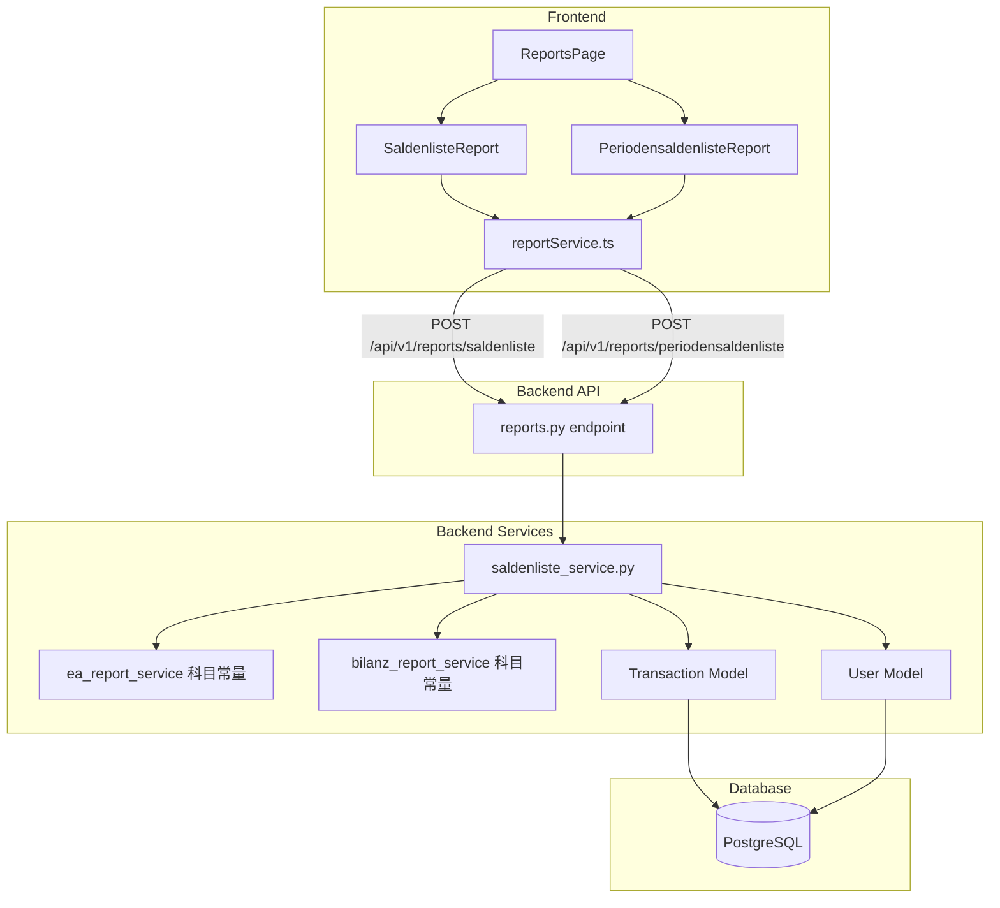

# 设计文档：Saldenliste 报表

## 概述

本设计为 Taxja 系统新增两种奥地利标准会计报表：

1. **Saldenliste mit Vorjahresvergleich（余额表含上年对比）**：展示各科目当期累计余额与上年同期对比，包含绝对偏差和百分比偏差。
2. **Periodensaldenliste（期间余额表）**：展示各科目按月份（1-12月）分列的金额及年度合计。

两种报表共享同一后端服务模块 `saldenliste_service.py`，根据用户类型（EA 个人用户 vs GmbH 用户）自动选择科目体系。前端新增两个 React 组件，集成到现有 `ReportsPage` 标签页导航中。

### 设计决策

- **单一服务模块**：两种报表逻辑相关性高（都需要科目映射、分组、汇总），放在同一个 `saldenliste_service.py` 中，避免重复代码。
- **复用现有科目映射**：复用 `ea_report_service.py` 和 `bilanz_report_service.py` 中已有的 `INCOME_GROUPS`/`EXPENSE_GROUPS` 和 `GUV_INCOME_ACCOUNTS`/`GUV_EXPENSE_ACCOUNTS` 常量，在 Saldenliste 服务中导入并转换为 Kontenklasse 分组结构。
- **POST 端点**：与现有 `/reports/ea-report` 和 `/reports/bilanz-report` 保持一致，使用 POST + `ReportRequest` body。
- **空报表返回零值**：当指定年份无交易数据时，返回完整的报表结构（所有金额为零），而非错误，与需求 4.5 一致。

## 架构



数据流：
1. 前端组件通过 `reportService.ts` 发起 POST 请求，传递 `tax_year` 和 `language`
2. API 端点验证用户认证，调用 `saldenliste_service.py` 对应函数
3. 服务层根据 `user.user_type` 选择科目体系，查询交易数据，计算余额/偏差
4. 返回结构化 JSON 数据，前端组件渲染表格

## 组件与接口

### 后端组件

#### 1. `saldenliste_service.py`（新建）

位置：`backend/app/services/saldenliste_service.py`


核心职责：
- `get_account_plan(user_type: UserType) -> List[AccountDef]`：根据用户类型返回科目列表
- `generate_saldenliste(db, user, tax_year, language) -> dict`：生成 Saldenliste mit VJ 报表
- `generate_periodensaldenliste(db, user, tax_year, language) -> dict`：生成 Periodensaldenliste 报表

内部辅助函数：
- `_map_transaction_to_konto(transaction, account_plan) -> str`：将交易映射到科目编号
- `_compute_yearly_balances(transactions, account_plan) -> Dict[str, Decimal]`：计算各科目年度累计余额
- `_compute_monthly_balances(transactions, account_plan) -> Dict[str, Dict[int, Decimal]]`：计算各科目月度金额
- `_compute_deviation(current: Decimal, prior: Decimal) -> dict`：计算偏差（绝对值 + 百分比，上年为零时百分比为 null）
- `_group_by_kontenklasse(balances, account_plan) -> List[dict]`：按 Kontenklasse 分组并计算小计
- `_build_summary_totals(groups, user_type) -> dict`：生成汇总行（Aktiva/Passiva/Ertrag/Aufwand/Gewinn-Verlust）

#### 2. 科目映射常量

在 `saldenliste_service.py` 中定义统一的科目映射结构 `KONTENPLAN_EA` 和 `KONTENPLAN_GMBH`：

```python
# EA 用户科目（简化）
KONTENPLAN_EA = [
    # Kontenklasse 4 - 收入
    AccountDef(konto="4000", kontenklasse=4, label_de="Umsatzerlöse", label_en="Revenue", label_zh="营业收入",
               income_categories=[IncomeCategory.SELF_EMPLOYMENT]),
    AccountDef(konto="4400", kontenklasse=4, label_de="Lohneinkünfte", label_en="Employment Income", label_zh="工资收入",
               income_categories=[IncomeCategory.EMPLOYMENT]),
    # ... 更多收入科目
    # Kontenklasse 7 - 支出
    AccountDef(konto="7000", kontenklasse=7, label_de="Abschreibungen", label_en="Depreciation", label_zh="折旧",
               expense_categories=[ExpenseCategory.DEPRECIATION]),
    # ... 更多支出科目
]

# GmbH 用户科目（完整 0-9）
KONTENPLAN_GMBH = [
    # Kontenklasse 0 - 资产
    AccountDef(konto="0600", kontenklasse=0, ...),
    # Kontenklasse 1 - 负债
    # ... 完整 0-9 科目
]
```

科目映射从现有 `ea_report_service.INCOME_GROUPS`/`EXPENSE_GROUPS` 和 `bilanz_report_service.GUV_INCOME_ACCOUNTS`/`GUV_EXPENSE_ACCOUNTS` 中的 category 映射关系派生，确保一致性。

#### 3. API 端点（扩展 `reports.py`）

新增两个端点，复用现有 `ReportRequest` schema：

```python
@router.post("/saldenliste")
def generate_saldenliste_endpoint(
    request: ReportRequest,
    current_user: User = Depends(get_current_user),
    db: Session = Depends(get_db),
):
    from app.services.saldenliste_service import generate_saldenliste
    return generate_saldenliste(db, current_user, request.tax_year, request.language)

@router.post("/periodensaldenliste")
def generate_periodensaldenliste_endpoint(
    request: ReportRequest,
    current_user: User = Depends(get_current_user),
    db: Session = Depends(get_db),
):
    from app.services.saldenliste_service import generate_periodensaldenliste
    return generate_periodensaldenliste(db, current_user, request.tax_year, request.language)
```

### 前端组件

#### 4. `SaldenlisteReport.tsx`（新建）

位置：`frontend/src/components/reports/SaldenlisteReport.tsx`

功能：
- 年份选择器（下拉框，最近 5 年）
- 调用 `reportService.generateSaldenliste(taxYear, language)` 获取数据
- 按 Kontenklasse 分组渲染表格，每组可折叠
- 列：科目编号 | 科目名称 | 当期 Saldo | 上年 Saldo | Abweichung（绝对值）| Abweichung（%）
- 每组底部显示小计行
- 表格底部显示汇总行（Aktiva/Passiva/Ertrag/Aufwand/Gewinn-Verlust）
- 正偏差百分比绿色，负偏差百分比红色
- 支持 i18n（通过 `useTranslation`）

#### 5. `PeriodensaldenlisteReport.tsx`（新建）

位置：`frontend/src/components/reports/PeriodensaldenlisteReport.tsx`

功能：
- 年份选择器
- 调用 `reportService.generatePeriodensaldenliste(taxYear, language)` 获取数据
- 按 Kontenklasse 分组渲染宽表格，每组可折叠
- 列：科目编号 | 科目名称 | 1月 | 2月 | ... | 12月 | 年度合计
- 支持水平滚动（`overflow-x: auto`）
- 每组底部显示月度小计行和年度小计
- 表格底部显示汇总行
- 支持 i18n

#### 6. `reportService.ts` 扩展

新增两个 API 调用方法：

```typescript
// Saldenliste mit Vorjahresvergleich
generateSaldenliste: async (taxYear: number, language: string = 'de'): Promise<SaldenlisteReport> => {
    const response = await api.post('/reports/saldenliste', { tax_year: taxYear, language });
    return response.data;
},

// Periodensaldenliste
generatePeriodensaldenliste: async (taxYear: number, language: string = 'de'): Promise<PeriodensaldenlisteReport> => {
    const response = await api.post('/reports/periodensaldenliste', { tax_year: taxYear, language });
    return response.data;
},
```

#### 7. `ReportsPage.tsx` 修改

在 `TabType` 中新增 `'saldenliste' | 'periodensaldenliste'`，在现有标签页（ea/bilanz/taxform）之后、generate/audit/export 之前插入两个新标签页按钮和对应的 tab content。

## 数据模型

### 后端数据结构

#### AccountDef（科目定义，NamedTuple 或 dataclass）

```python
@dataclass
class AccountDef:
    konto: str              # 科目编号，如 "4000"
    kontenklasse: int       # 科目分类 0-9
    label_de: str           # 德语名称
    label_en: str           # 英语名称
    label_zh: str           # 中文名称
    income_categories: List[IncomeCategory] = field(default_factory=list)
    expense_categories: List[ExpenseCategory] = field(default_factory=list)
```

#### Saldenliste mit VJ 响应结构

```python
{
    "report_type": "saldenliste",
    "tax_year": 2026,
    "comparison_year": 2025,
    "user_name": "...",
    "user_type": "self_employed",
    "generated_at": "2026-03-15",
    "groups": [
        {
            "kontenklasse": 4,
            "label": "Erträge",  # 根据 language 参数
            "accounts": [
                {
                    "konto": "4000",
                    "label": "Umsatzerlöse",
                    "current_saldo": 50000.00,
                    "prior_saldo": 45000.00,
                    "deviation_abs": 5000.00,
                    "deviation_pct": 11.11  # null if prior_saldo == 0
                }
            ],
            "subtotal_current": 50000.00,
            "subtotal_prior": 45000.00,
            "subtotal_deviation_abs": 5000.00,
            "subtotal_deviation_pct": 11.11
        }
    ],
    "summary": {
        "aktiva_current": 0.0,       # EA 用户为 0
        "aktiva_prior": 0.0,
        "passiva_current": 0.0,
        "passiva_prior": 0.0,
        "ertrag_current": 50000.00,
        "ertrag_prior": 45000.00,
        "aufwand_current": 30000.00,
        "aufwand_prior": 28000.00,
        "gewinn_verlust_current": 20000.00,
        "gewinn_verlust_prior": 17000.00
    }
}
```

#### Periodensaldenliste 响应结构

```python
{
    "report_type": "periodensaldenliste",
    "tax_year": 2026,
    "user_name": "...",
    "user_type": "self_employed",
    "generated_at": "2026-03-15",
    "groups": [
        {
            "kontenklasse": 4,
            "label": "Erträge",
            "accounts": [
                {
                    "konto": "4000",
                    "label": "Umsatzerlöse",
                    "months": [4000.0, 4500.0, 3800.0, ...],  # 12 个月
                    "gesamt": 50000.00
                }
            ],
            "subtotal_months": [4000.0, 4500.0, 3800.0, ...],
            "subtotal_gesamt": 50000.00
        }
    ],
    "summary": {
        "aktiva_months": [...],
        "aktiva_gesamt": 0.0,
        "passiva_months": [...],
        "passiva_gesamt": 0.0,
        "ertrag_months": [...],
        "ertrag_gesamt": 50000.00,
        "aufwand_months": [...],
        "aufwand_gesamt": 30000.00,
        "gewinn_verlust_months": [...],
        "gewinn_verlust_gesamt": 20000.00
    }
}
```

### 前端 TypeScript 类型

```typescript
// Saldenliste mit VJ
export interface SaldenlisteAccount {
    konto: string;
    label: string;
    current_saldo: number;
    prior_saldo: number;
    deviation_abs: number;
    deviation_pct: number | null;
}

export interface SaldenlisteGroup {
    kontenklasse: number;
    label: string;
    accounts: SaldenlisteAccount[];
    subtotal_current: number;
    subtotal_prior: number;
    subtotal_deviation_abs: number;
    subtotal_deviation_pct: number | null;
}

export interface SaldenlisteSummary {
    aktiva_current: number;
    aktiva_prior: number;
    passiva_current: number;
    passiva_prior: number;
    ertrag_current: number;
    ertrag_prior: number;
    aufwand_current: number;
    aufwand_prior: number;
    gewinn_verlust_current: number;
    gewinn_verlust_prior: number;
}

export interface SaldenlisteReport {
    report_type: string;
    tax_year: number;
    comparison_year: number;
    user_name: string;
    user_type: string;
    generated_at: string;
    groups: SaldenlisteGroup[];
    summary: SaldenlisteSummary;
}

// Periodensaldenliste
export interface PeriodensaldenlisteAccount {
    konto: string;
    label: string;
    months: number[];  // 12 elements
    gesamt: number;
}

export interface PeriodensaldenlisteGroup {
    kontenklasse: number;
    label: string;
    accounts: PeriodensaldenlisteAccount[];
    subtotal_months: number[];  // 12 elements
    subtotal_gesamt: number;
}

export interface PeriodensaldenlisteSummary {
    aktiva_months: number[];
    aktiva_gesamt: number;
    passiva_months: number[];
    passiva_gesamt: number;
    ertrag_months: number[];
    ertrag_gesamt: number;
    aufwand_months: number[];
    aufwand_gesamt: number;
    gewinn_verlust_months: number[];
    gewinn_verlust_gesamt: number;
}

export interface PeriodensaldenlisteReport {
    report_type: string;
    tax_year: number;
    user_name: string;
    user_type: string;
    generated_at: string;
    groups: PeriodensaldenlisteGroup[];
    summary: PeriodensaldenlisteSummary;
}
```


## 正确性属性（Correctness Properties）

*属性（Property）是指在系统所有有效执行中都应成立的特征或行为——本质上是对系统应做什么的形式化陈述。属性是人类可读规范与机器可验证正确性保证之间的桥梁。*

### Property 1: 用户类型决定科目体系

*For any* 用户类型，若 user_type 属于 {employee, self_employed, landlord, mixed}，则 `get_account_plan` 返回的科目列表仅包含 Kontenklasse 4 和 7；若 user_type 为 gmbh，则返回的科目列表覆盖 Kontenklassen 0-9。

**Validates: Requirements 1.1, 1.2**

### Property 2: 交易到科目的映射一致性

*For any* 具有有效 income_category 或 expense_category 的交易，`_map_transaction_to_konto` 应返回一个属于对应科目体系的有效科目编号，且该科目的 Kontenklasse 与交易类型一致（收入映射到收入类科目，支出映射到支出类科目）。

**Validates: Requirements 1.3**

### Property 3: 年度余额计算正确性

*For any* 交易集合和指定年份，`_compute_yearly_balances` 计算的每个科目 Saldo 应等于该年份内所有映射到该科目的交易金额之和。

**Validates: Requirements 2.2, 2.3**

### Property 4: 偏差计算正确性（含除零保护）

*For any* 两个 Decimal 值 current 和 prior，`_compute_deviation` 返回的绝对偏差应等于 current - prior；当 prior ≠ 0 时，百分比偏差应等于 (current - prior) / prior × 100；当 prior = 0 时，百分比偏差应为 null。

**Validates: Requirements 2.4, 2.5**

### Property 5: Kontenklasse 分组不变量

*For any* 科目余额集合，按 Kontenklasse 分组后，每个组内的所有科目应具有相同的 Kontenklasse 值，且所有科目恰好出现在一个组中（无遗漏、无重复）。

**Validates: Requirements 2.6, 3.4**

### Property 6: 小计等于组内科目之和

*For any* Kontenklasse 分组，该组的小计值应等于组内所有科目对应值之和（对于 Saldenliste：当期小计 = Σ当期 Saldo，上年小计 = Σ上年 Saldo；对于 Periodensaldenliste：每月小计 = Σ该月各科目金额，年度小计 = Σ各科目 Gesamt）。

**Validates: Requirements 2.7, 3.5**

### Property 7: Gewinn/Verlust = Ertrag - Aufwand

*For any* 报表数据，汇总行中的 Gewinn/Verlust 值应等于 Ertrag 合计减去 Aufwand 合计。

**Validates: Requirements 2.8, 3.6**

### Property 8: 月度金额计算正确性

*For any* 交易集合和指定年份，`_compute_monthly_balances` 计算的每个科目每月金额应等于该月内所有映射到该科目的交易金额之和。

**Validates: Requirements 3.2**

### Property 9: 年度合计一致性

*For any* 科目的 Periodensaldenliste 数据，其 Gesamt（年度合计）应等于该科目 12 个月金额之和。

**Validates: Requirements 3.3, 3.7**

### Property 10: 用户数据隔离

*For any* 两个不同用户，用户 A 生成的报表数据不应包含用户 B 的交易数据。即报表中所有科目余额仅来源于当前认证用户的交易。

**Validates: Requirements 4.4**

### Property 11: 科目三语标签完整性

*For any* 科目定义（无论 EA 或 GmbH 科目体系），其 label_de、label_en、label_zh 均应为非空字符串。

**Validates: Requirements 8.1**

## 错误处理

| 场景 | 处理方式 |
|------|---------|
| 未认证用户访问报表端点 | 返回 HTTP 401，前端显示登录提示 |
| 指定年份无交易数据 | 返回完整报表结构，所有金额为零（需求 4.5） |
| 交易缺少 category | 映射到 "其他" 科目（Sonstige），不丢弃数据 |
| 上年 Saldo 为零 | 百分比偏差设为 null，前端显示 "—"（需求 2.5） |
| API 请求失败（网络错误） | 前端显示错误提示，保留上次成功加载的数据 |
| 无效 tax_year 参数 | 后端返回 HTTP 422（Pydantic 验证），前端显示验证错误 |
| 无效 language 参数 | 后端默认使用 "de"（德语） |

## 测试策略

### 双重测试方法

本功能采用单元测试 + 属性测试的双重策略：

- **单元测试**：验证具体示例、边界情况和错误条件
- **属性测试**：验证跨所有输入的通用属性

### 属性测试（Property-Based Testing）

- **库**：Hypothesis（Python，后端已使用）
- **配置**：每个属性测试至少运行 100 次迭代（`@settings(max_examples=100)`）
- **文件**：`backend/tests/test_saldenliste_properties.py`
- **标签格式**：每个测试用注释标注对应的设计属性
- **要求**：每个正确性属性（Property 1-11）由一个独立的属性测试函数实现

```python
# Feature: saldenliste-reports, Property 1: 用户类型决定科目体系
@given(user_type=st.sampled_from(list(UserType)))
@settings(max_examples=100)
def test_account_plan_by_user_type(user_type):
    ...
```

### 单元测试

- **文件**：`backend/tests/test_saldenliste_service.py`
- 覆盖内容：
  - API 端点存在性和认证要求（需求 4.1-4.3）
  - 空数据年份返回零值报表（需求 4.5，边界情况）
  - 具体交易数据的报表生成示例
  - 语言参数切换验证

### 前端测试

- **文件**：`frontend/src/components/reports/__tests__/SaldenlisteReport.test.tsx` 和 `PeriodensaldenlisteReport.test.tsx`
- **库**：vitest + React Testing Library
- 覆盖内容：
  - 组件渲染和数据展示
  - 年份选择器交互
  - i18n 翻译键存在性验证
